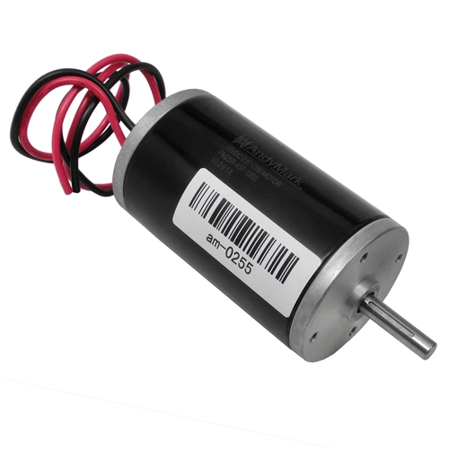
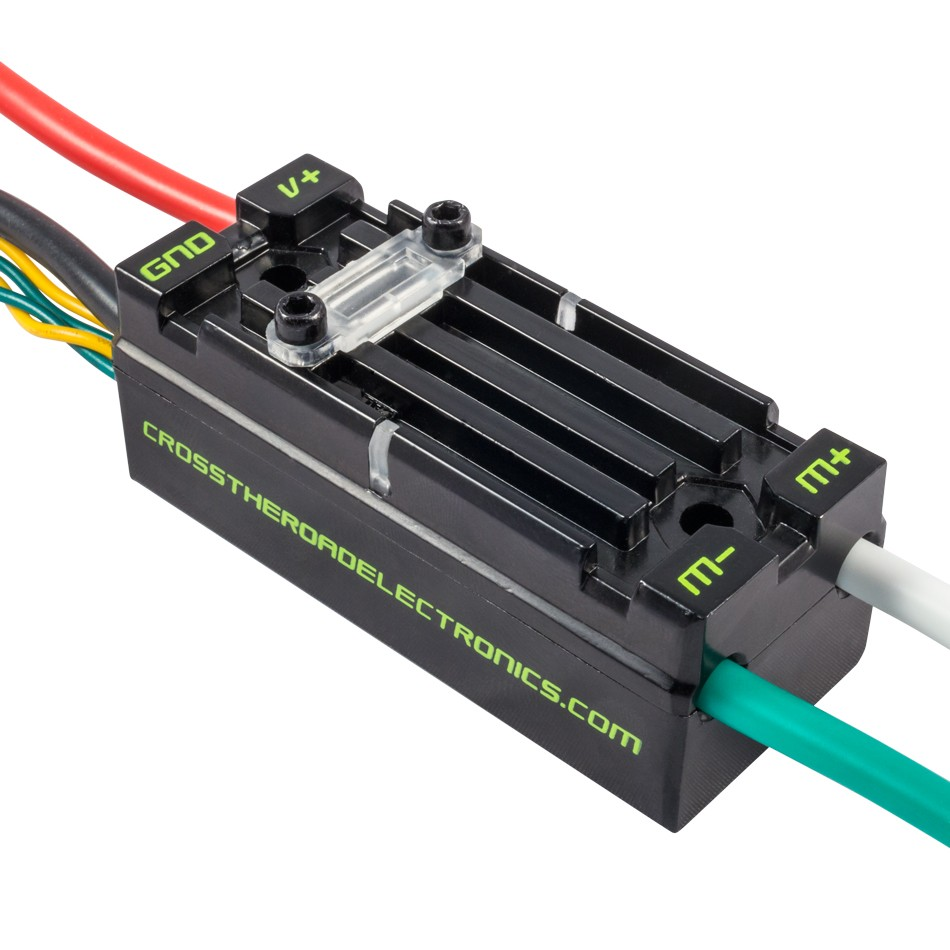

Motors and Speed Controllers
============================

   
Simply put, motors turn when given power. The amount and direction of power to supply to a motor is controlled by a speed controller.
The speed controller allows values from -1 to 1.

Example:

.. code-block:: java

	speedController.set(1.0);  // full power forwards
	speedController.set(0.5);  // half power forwards
	speedController.set(0);     // stop
	speedController.set(-0.5); // half power backwards
	speedController.set(-1.0); // full power backwards

There are several types of speed controllers.

 - Talon SRX
	
	.. image:: ./_static/217-8080.jpg
		:width: 30%
	
	This uses the CANTalon class in code, and uses a CAN channel, configured in the RoboRIO web dashboard.
	Talons can be given brake mode or coast mode.
	They can also be configured to respond to a limit switch directly, but this is rarely used.

 - Victor or VictorSP
	
	.. image:: ./_static/217-9090.jpg
		:width: 30%
	
	The speed controller we often use the most. Connected via PWM.
	
 - SPARK
	
	.. image:: ./_static/spark.jpg
		:width: 30%
	
	A low cost speed controller that we usually don’t use. Connected via PWM.
	Use it just like a Victor, except use the SPARK type.
	
 - Jaguar
 
	.. image:: ./_static/mickjaguar.png
		:width: 60%
	
	They’re old, huge, and no one really uses them anymore.
	We used to use them a long time ago though, so if you find one, you’ll know what it is.

It is simple to create a speed controller in code. WPILib has a custom class for each motor controller that handles voltage, pwm, and other power stuff internally, so all you have to do is give the motor a value from -1 to 1.

The constructor for motor controllers takes the pwm pin as an argument.

Examples:

.. code-block:: java

	CANTalon DRIVE_LEFT_FRONT = new CANTalon(3);

	Victor DRIVE_RIGHT_FRONT = new Victor(3);

	Spark CLIMBER_MOTOR = new Spark(4);

Note that if a speed controller or motor's wiring is flipped, it will run backwards. This means that when you set it to 1.0, the motor will actually run full power in reverse. It is recommended that electrical fixes this in the wiring of the robot, but sometimes this is not possible due to time constraints. If so, remember that you can always use:

.. code-block:: java

	speedController.setInverted(true);

This flips the speed controller in code, fixing the problem.

Make sure to be familiar with the status light meanings of each speed controller. It can really help in certain debugging situations.
`Status light reference <https://wpilib.screenstepslive.com/s/4485/m/24166/l/144972-status-light-quick-reference>`_

Also note that speed controllers can break down. If you observe any odd behavior, such as a speed controller moving a motor when the robot is disabled, first check for any wire shorts, bad crimps, and the like. If it is certain that there are no electrical problems, then the speed controller may be broken.

For Talon SRX’s, make sure to update the firmware before inspection at competitions, otherwise the inspector might not be happy.

When debugging code related to speed controllers, it is helpful to look at the speed controller LED lights. For example, if the speed controller is flashing full green, but the motor is not moving, it may instead be an electrical problem.

For more information on speed controllers, see `WPILib's documentation on speed controllers <https://wpilib.screenstepslive.com/s/4485/m/13809/l/599702-driving-motors-with-speed-controller-objects-victors-talons-and-jaguars>`_.

For more information on CAN, see `WPILib's documentation on using CAN devices <https://wpilib.screenstepslive.com/s/4485/m/13809/c/88896>`_.

.. toctree::
	:glob:
	:maxdepth: 10
	:caption: Contents:
	
	