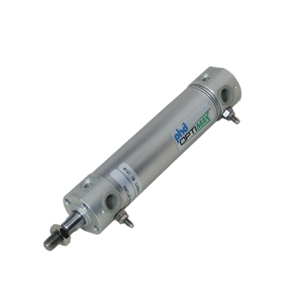
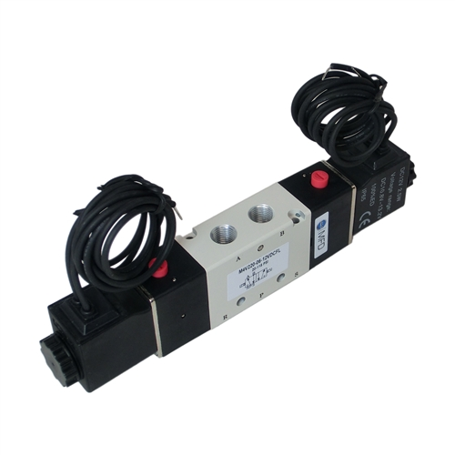

Pneumatics and Solenoids
========================

Instead of how motors are directly controlled by electricity, pneumatics are controlled by air pressure. Instead of a turning motion like with motors, pneumatics are cylinders that can push a shaft outwards and retract it inwards. These are often used in Drive for gear shifting, or subsystems when a pushing or retracting motion is required.

Instead of being connected to any pin on the RoboRIO, pneumatics are connected to the Pneumatics Control Module (PCM).

Mainly, software controls the pistons through Solenoids.
We usually use DoubleSolenoids, which can be set to push, retract, or neutral.
A single action Solenoid can only be set to either push or neutral. Because they give us less control, we rarely use these unless we run out of PCM pins.

DoubleSolenoids use two pins on the PCM. Example:

.. code-block:: java

	DoubleSolenoid grabber = new DoubleSolenoid(0, 1);

Single action Solenoids only use one pin on the PCM. Example:

.. code-block:: java

	Solenoid grabber = new Solenoid(0);

To set the position of a DoubleSolenoid, use the DoubleSolenoid.Value enum.

Example:

.. code-block:: java

	grabber.set(Value.kForward);

For single action Solenoids, just use a boolean on whether to push or not.

Example:

.. code-block:: java

	grabber.set(true);

Make sure to be familiar with the status light meanings of the PCM. It can really help in certain debugging situations.
`Status light reference <https://wpilib.screenstepslive.com/s/4485/m/24166/l/144972-status-light-quick-reference>`_

Additionally, if the PCM isn't working, make sure to check the PCM on the RoboRIO webdashboard at 172.22.11.2. The PCM should be on CAN channel 0, and have no sticky faults. Press the Self-Test button to check for sticky faults, which should print out the issue if there is one.
Often, the issue is faulty wiring (e.g. bad crimp). Once all electrical issues are resolved, quadruple click the Self-Test button to clear the faults.
	
When debugging code related to solenoids, it's helpful to examine the LEDs on the solenoids. If the LEDs are changing correctly but no pneumatic cylinders are actuating, then the problem may be an issue with the pneumatics.

For more information, see `WPILib's documentation on pneumatics <https://wpilib.screenstepslive.com/s/4485/m/13809/l/599708-operating-pneumatic-cylinders-solenoids>`_.

.. toctree::
	:glob:
	:maxdepth: 10
	:caption: Contents:
	
	