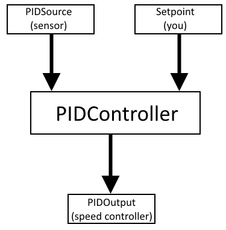

Using a PID Controller
======================

This section of the guide assumes you only want to use a PID someone else already created. If you want to create and tune a PID, see the `Tuning PIDs <pidcontroller2.html>`_ section.

A PID Controller is a way to get a sensor reading to a certain value by outputting to an actuator.

For example, a PID Controller would be used to get an encoder to turn 10 rotations by running a motor.

In this case, the PIDSource would be the encoder, and the setpoint would be 10 rotations. Then, the PIDOutput would be a speedcontroller connected to the motor.

Although the internals of PIDs may be complicated, a well tuned PID controller will simply do as instructed. If the setpoint is set to 10 rotations, for example, the motor will try to do exactly 10 rotations. A well tuned PID corrects if it overshoots, and tries to get to the setpoint in a smooth way.

Creating a PID:

.. code-block:: java

	PIDController DRIVE_CONTROL = new PIDController(0.0015, 0.001, 0, DRIVE_ENCODER, DRIVE_MOTORS);

Here, a PID Controller that takes input from the Drive Encoder and outputs to the Drive Motors is given the tuned PID values P = 0.0015, I = 0.001, and D = 0.

Then, to make the robot attempt to go forward 10 feet:

.. code-block:: java

	DRIVE_ENCODER.reset();
	DRIVE_CONTROL.reset();
	DRIVE_CONTROL.setSetpoint(10.0 * TICKS_PER_FOOT);
	DRIVE_CONTROL.enable();

The above code could be placed in the initialize() block of a command.

Then, since a PID automatically outputs to the motor, the execute() block should often be empty.

To check if the robot is at its goal, check the error on the controller.

.. code-block:: java

	@Override
	protected boolean isFinished()
	{
	    double error = Drive.DRIVE_CONTROL.getError();
	    if (Math.abs(error) <= MAX_ERROR)
	    {
	        return true;
	    }
	    return false
	}

Then, to disable the PID Controller, in end():

.. code-block:: java

	// disable our PIDControllers and then stop all motors
	Drive.DRIVE_CONTROL.disable();
	Drive.setAllMotors(0);

Note how the drive encoder was reset, since we want to go forward 10 feet. If it is not reset, then if the encoder was, for example, already at 5 feet, then the robot would only go 5 feet forwards.

However, note that you do not always want to reset the encoder before setting the setpoint. If using an elevator with known height setpoints, it would be wise simply to use those setpoints and never reset the encoder.

Tuning PID values is covered in the `Tuning PIDs <pidcontroller2.html>`_ section.
   
.. toctree::
	:glob:
	:maxdepth: 10
	:caption: Contents:
	
	