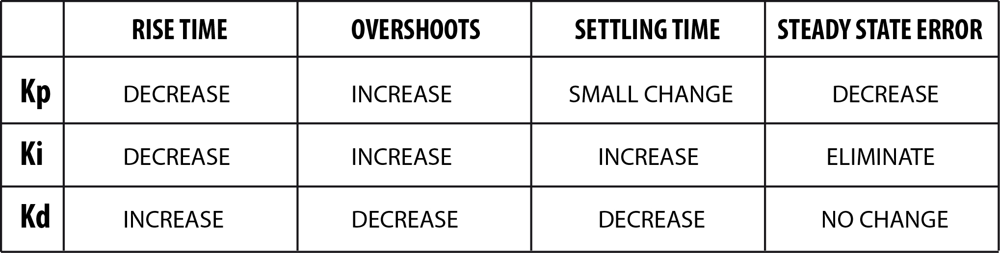

Tuning a PID Controller
=======================

This is a more advanced guide on how to use PID Controllers. For how to use a PID Controller in a command, see `Using PIDs <pidcontroller1.html>`_.

Along with giving a PIDSource and a PIDOutput, the P, I, and D values on a PID Controller must also be tuned for it to function. Although one can make educated guesses as to what those values should be, tuning can only really be performed with a robot to test on.

P, I, and D stand for Proportional, Integral, and Derivative. If you know calculus, those words should make sense. If you don't, it doesn't really matter too much.

Also, note that PID Controller use something called error.

.. code-block:: java

	error = setpoint - sensor.pidGet();

Initial Guess
-------------

The P, or Proportional, value is a direct multiplier from the error to the output. With only a P value, the output would look like:

.. code-block:: java

	output = error * P;

**Example for a Drive Distance Controller:**

First, you want to find (experimentally) how many encoder ticks per foot the robot travels. Let's say you find that there are 100 encoder ticks per foot.

Then, say that you want the robot to go at full power when it is 5 feet away from the target.

.. code-block:: java

	1.0 = 5 ft * 100 ticks/ft * P
	P = 0.002

Then, your initial P value guess would be 0.002.

For initial guesses, leave the I and D values as 0.

I stands for Integral, which is a sum of how much "total error" the controller has accumulated over time. This means that if there is a small amount of error, but it stays there for a long time, the controller will output to the motor to fix it.

D stands for Derivative. We rarely use this, but it's used to tone down the output if we're approaching the setpoint quickly, which decreases overshoot. However, this is hard to tune.

Tuning
------

**Note:** Before you start tuning, make sure that setting the motor to a positive value leads to an increasingly positive encoder value, and vice versa. If not, the PID Controller may not function correctly. Instead, what will happen is that the PID Controller tries to spin the motor towards the goal, but instead causes the motor to spin backwards. This will increase the error, and thus even further increase the motor output in the wrong direction, causing the motor to spin the wrong way at full power forever. This may be unsafe or could damage the robot. So, make sure that the motor and the encoder have the correct polarity before you start tuning and testing.

The next step is to test the guess. Plug in the guessed values into the PID Controller.

Now, observe how the robot reacts. There are 4 things to keep track of:

 - Rise Time
	How fast the robot approaches the setpoint. For drive distance, this would be how fast the robot rushes forward to its target. This may be important in autonomous mode, where reaching the goal quickly matters.
 - Overshoot
	How much the robot overshoots its goal. For drive distance, this would be seen as how much the robot rushes too far forward, and then runs backwards to get to the goal.
 - Settling Time
	How long it takes the robot to stop moving. For drive distance, it is how long the robot keeps driving back and forth, trying to reach its goal. This may be important in autonomous mode, where reaching the goal quickly matters.
 - Steady State Error
	How far away the robot is from its goal once it stops moving. For drive distance, this would be measured by marking 10 feet on the floor with tape, and then seeing how far away the robot is. This is sometimes called *accuracy*. This is usually very important for autonomous and for subsystems, which must move to accurate positions or turn to accurate angles.

This is a table that helps tune these 4 things until the robot behaves correctly:

One important thing to note is that we RARELY ever need to use a D value, since we rarely care about overshoot, as long as the end result is accurate. Almost always, adding a D value is a bad idea.

A simple rule of thumb for tuning PIDs:

1. Increase P until it starts oscillating (the robot never stops moving, keeps going back and forth)
2. Pull back P a little bit and add a small I value (for accuracy).
3. Increase the I value until the robot accurately reaches its goal.
4. Make small adjustments as necessary.

PID tuning **takes time**. Make sure time is scheduled in the build season for this, especially for more complex PID systems, such as those that control subsystems, depend on potentiometers, control steering, or involve custom implementations. Tuning a PID may takes days, and tuning multiple PIDs and an entire autonomous plan may even take weeks, especially if debugging is involved too.

.. toctree::
	:glob:
	:maxdepth: 10
	:caption: Contents:
	
	