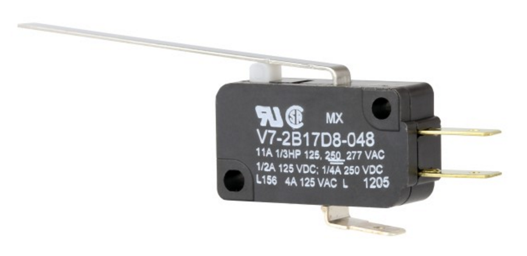

Limit Switches
==============

A limit switch is a DigitalInput that returns true when the bar is pressed down, and false when it is not pressed down.

Sometimes, the limit switch’s true/false will be flipped due to flipped wiring.

These are often used as a way to stop a belt at either of its two ends, or detect the presence of something that presses against it.

In code, this is used as a `DigitalInput <digitalinputs.html>`_.

.. toctree::
	:glob:
	:maxdepth: 10
	:caption: Contents:
	
	