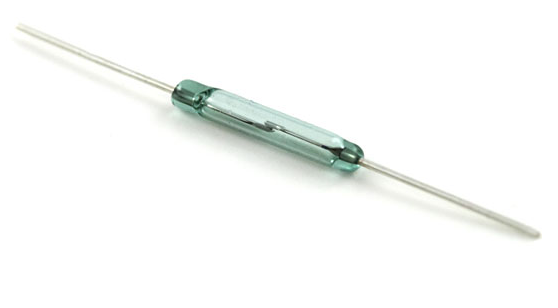

Reed Switches
=============

A reed switch is a DigitalInput that senses the presence of a magnetic field. It is similar to a limit switch, but does not require that any direct contact. Instead, when a magnet on the robot comes close to the reed switch, the reed switch will change its output.

Note that some reed switches are active low, meaning that they normally return true, and only return false when a magnet is near. In this case, it will have to be manually flipped in code. Keep this in mind if a reed switch does not work as expected.

In code, this is used as a `DigitalInput <digitalinputs.html>`_.

.. toctree::
	:glob:
	:maxdepth: 10
	:caption: Contents:
	
	