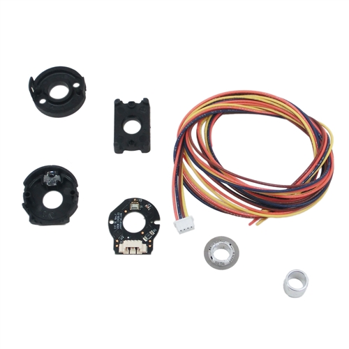
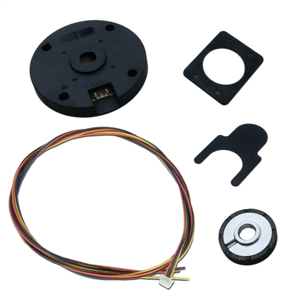

Encoders
========

Encoders come in many shapes and sizes, but as far as usage is concerned, they measure rotations.

Encoders require two DigitalInput pins.
Example:

.. code-block:: java

	Encoder enc = new Encoder(3, 4);

Since Encoders are NOT absolute position sensors, they reset to 0 whenever the robot starts.

Encoders are one of the most commonly used sensors, simply because any motor often uses an encoder to control its movement.
Access how many rotations an encoder has rotated using:

.. code-block:: java

	encoder.get()

However, the encoder is most commonly used as a PIDSource, without calling get() directly.

Note that it is still possible to read from DigitalInputs even while the robot is disabled. Thus, encoders can measure rotations even when the robot is disabled.

If the two encoder pins are flipped in RobotMap or in wiring from how they should be, then the encoder will tick backwards, meaning that when the encoder spins forwards, it will given an increasingly negative reading. You can change this either by switching the wiring, or switching the pins in RobotMap.

.. toctree::
	:glob:
	:maxdepth: 10
	:caption: Contents:
	
	