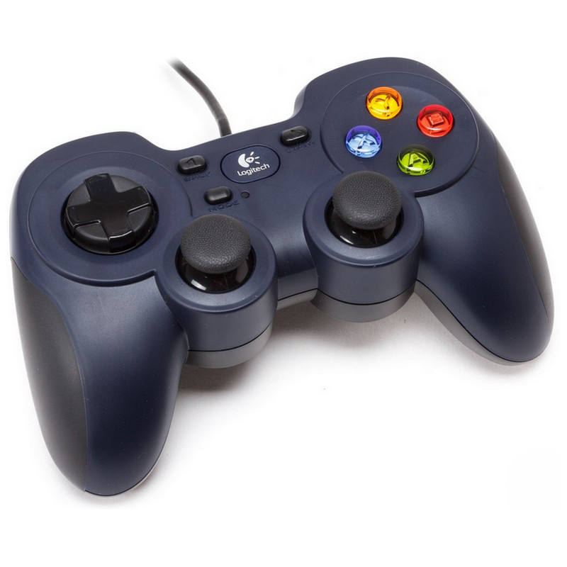
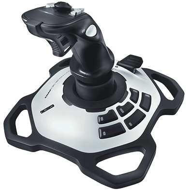

Joysticks
==========

A Joystick represents a USB controller, plugged into the Driver Station laptop. It is given a port, which corresponds to its port assigned on the FRC Driver Station program.

For any controller, make sure to write down its button numbers, axis numbers, and which axes are inverted. Also check for a switch on the back, to see if it switches the controller type.
Access this information by plugging it into the computer, and looking at the Joysticks tab on FRC Driver Station.

Joystick Buttons
^^^^^^^^^^^^^^^^

Joystick buttons can be accessed with:

.. code-block:: java

    joystick.getRawButton(int buttonNumber)
	
This returns true if the button is pressed down, and false if it is not. However, we normally use event handlers to manage button presses, instead of getRawButton.

To attach a command to a certain button press, first create a Button. Then attach a command to it.

Example:

.. code-block:: java
    
    // keep track of the B button on the operator's controller in code
    Button closeClawButton = new JoystickButton(operator, 2);

    // start the command CloseClaw() whenever the operator's B button is pressed
    closeClawButton.whenPressed(new CloseClaw());

In addition to whenPressed, you can also attach commands to whenReleased, whileHeld, etc, although this can be finicky at times and lead to weird behavior.

Joystick Axes
^^^^^^^^^^^^^

When it comes to thumbsticks on a controller, or any other free moving component of the joystick, these are accessed by:

.. code-block:: java
    
    joystick.getRawAxis(int axisNumber)

These values go from -1 to 1, and depend on how far the stick is tilted. So, for example, if you tilt the thumbstick all the way forward, you'll get 1 on the y axis, and if you tilt the thumbstick all the way back, you'll get -1.

When it comes to axis numbers on a controller, usually:
 - 0 is the left thumbstick's X axis
 - 1 is the left thumbstick's Y axis
 - 2 is the right thumbstick's X axis
 - 3 is the right thumbstick's Y axis

However, many controllers are different from these axis numbers, so make sure to check.

This is very commonly used to control the robot’s driving.
Joystick axes should be given deadzones, so that any input under 0.1 should be seen as 0. Otherwise, when motors are set to low values like 0.02, they can’t actually move and instead just make annoying squeaking sounds.

Here's a simple deadzoning function:

.. code-block:: java

    public static double deadzone(double value, double deadzone)
    {
        if (Math.abs(value) < deadzone)
        {
            return 0;
        }
        return value;
    }

Then, to use the deadzoning function:

.. code-block:: java

    joystickValue = deadzone(joystickValue, 0.1);

Often, axes are flipped on the controller, which cause up to be negative and down to be positive. Firstly, check for a switch on the back of the controller that will switch its controller mode, which will often fix this issue. If there isn’t one, then just flip it manually in code.

Sometimes, the triggers are seen as axes instead of buttons. Firstly, check for a switch on the back of the controller that will switch its controller mode, which will often fix this issue. If there isn’t one, either make your own custom button handler, or implement the Button interface.

Joystick POV
^^^^^^^^^^^^

Very rarely, the POV (known as a D-pad) is used.
Use:

.. code-block:: java
    
    getPOV(int povNumber)

.. toctree::
	:glob:
	:maxdepth: 10
	:caption: Contents:
	
	