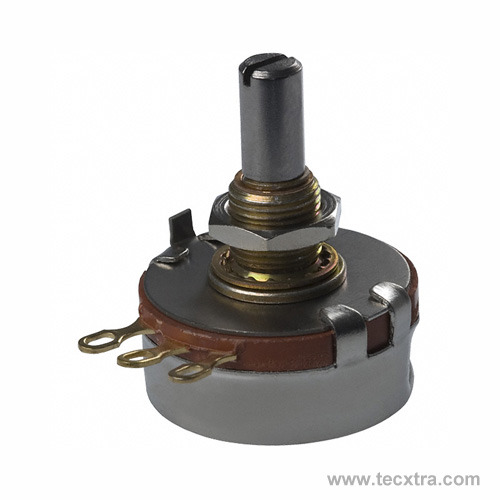

Potentiometers
==============

Potentiometers also measure rotations, but are absolute rotation sensors, meaning that if the robot shuts down, the potentiometer will still know what angle it is rotated at.

Despite being an absolute position sensor, if the gear ratio of the potentiometer to the actual part on the robot is not 1-1, the potentiometer will not work as an absolute position sensor. When using a potentiometer, make sure that is taken care of in the design.

Note that Potentiometer is not a class. It is an interface. That means you must implement get(), as well as the PIDSource interface, on your own.

So, in this case, plug in the potentiometer as an AnalogInput, and turn the knob and observe the AnalogInput value. Then, convert that value to an angle.

It may be worthwhile to examine a previous implementation:

`Team93Potentiometer, used in 2015 <http://nacsvn.aasd.k12.wi.us/repos/nac-software-2015/robot/trunk/Team93Robot2015/src/org/usfirst/frc93/Team93Robot2015/utilities/Team93Potentiometer.java>`_

Note that potentiometers are NOT free spinning. They can only spin from one end to the other (often about 270 degrees), and spinning past the potentiometer's range will break it. Make sure this is accounted for in the design or in software. You may want to use a limit switch to know when to stop.

There are free spinning potentiometers called Magnetic Encoders. These operate the same way as a potentiometer.

.. toctree::
	:glob:
	:maxdepth: 10
	:caption: Contents:
	
	