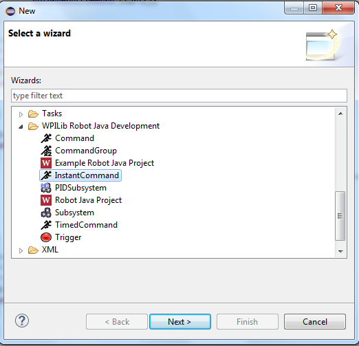

InstantCommand
==============

Instant Commands are certain types of commands that only run once, then finish. Often, there are many commands that simply call a method in the initialize block, then immediately end, such as commands that set solenoids. For these types of commands, InstantCommands are useful.

To create an InstantCommand file, **right click on the project** -> **New** -> **Other**:

A new InstantCommand looks like this:

.. code-block:: java

	package org.usfirst.frc.team93.robot.commands;

	import edu.wpi.first.wpilibj.command.InstantCommand;

	/**
	 *
	 */
	public class ExampleInstantCommand extends InstantCommand {

	    public ExampleInstantCommand() {
	        super();
	        // Use requires() here to declare subsystem dependencies
	        // eg. requires(chassis);
	    }

	    // Called once when the command executes
	    protected void initialize() {
	    }

	}

Then, all you need to do is put the code that would go in the command into this InstantCommand's initialize() block.

.. code-block:: java

    // Called once when the command executes
    protected void initialize()
    {
        // code goes here
        // e.g. Claw.openClaw();
    }

Then, the command will immediately end after the initialize() call.

**Note:** In the FRC Simulator, the simulation package may not know about InstantCommands, and their usage will cause the simulation to be unable to build. In this case, you may have to use your own implementation of InstantCommand. This is easy to do:

.. code-block:: java

    public class InstantCommand extends Command
    {
        @Override
        protected boolean isFinished()
        {
            return true;
        }
    }

.. toctree::
	:glob:
	:maxdepth: 10

