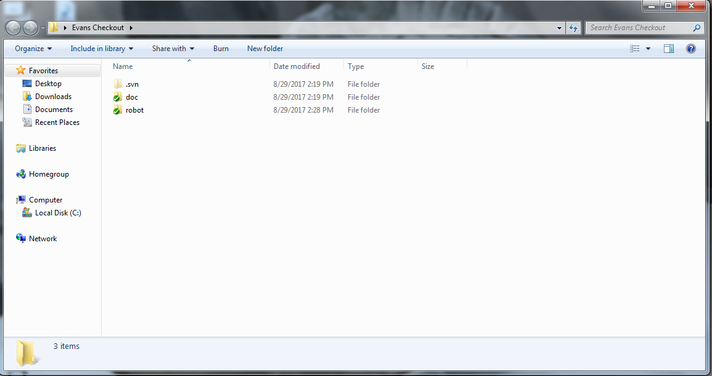

SVN Checkout
============

An **SVN Checkout** is the way to obtain a copy of the code from the repository. When you checkout a copy of the code, any edits you make will only exist on your copy of the code until it is *committed*. Additionally, others' committed changes will not affect your checkout until it is *updated*.

Knowing how to make an SVN Checkout is necessary, since you must already have a copy of the code before making a modification to it.

The first step is to make a new folder, since you can only checkout to empty folders. Do not make the checkout the same as your workspace, or eclipse-generated files will show up in it.

Clicking the SVN Checkout entry opens the SVN Checkout window.

Make sure the URL is correct. Usually, if you want a copy of the online repository's code, you will use the URL:

.. code-block:: html

	http://nacsvn.aasd.k12.wi.us/repos/nac-software-yyyy/

where yyyy is the school year. For example, the 2016-17 school year's code is at `http://nacsvn.aasd.k12.wi.us/repos/nac-software-2017/ <http://nacsvn.aasd.k12.wi.us/repos/nac-software-2017/>`_.

If you're checking out from a USB repository, use a file path, such as:

.. code-block:: html

	file:///E:/nac-software-yyyy/

The checkout directory should match the folder you just created.

For checkout depth, if you want the entire checkout, with all of the files, use **Fully recursive**. This is usually a good choice, so choose this one if you're unsure.

If you only want the top level, with no subfolders or subfiles, use **Immediate children, including folders**. This is only really useful in cases where the repository is gigantic, and making a full checkout would be very slow. After using this option, you must then use SVN Update to get the subfiles and subfolders you want.

For the Revision option, **HEAD revision** is the most up to date revision. This is usually the revision that you want.

If you for some reason want an old revision, you can enter the revision number to checkout from an old revision instead.

Press OK to start the checkout.

The checkout will then start, and later finish, after all files are added.

The folder should then contain the repository's contents.

.. toctree::
	:glob:
	:maxdepth: 10
	:caption: Contents