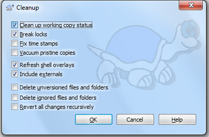

SVN Cleanup
===========

Things can go wrong, and when this occurs, this can temporarily break the checkout.

For example, if an SVN Update is cancelled, it may leave locks on the files, meaning that SVN cannot modify them. Now, if you try to SVN Update again, it will fail.

The solution to this is to use SVN Cleanup. Right click and go to the **TortoiseSVN** menu. Then, choose **Clean up...**

This will open the cleanup window. You want to make sure **Break locks** and **Clean up working copy status** are checked, and it can be nice to check **Refresh shell overlays** too.

Click OK to start cleaning up.

After cleanup has finished, you will now see that SVN updating works again.

If anything weird goes on with the checkout, the first step should usually be to try SVN Cleanup.

Remember that SVN Cleanup will NOT `resolve conflicts <svnconflict.html>`_, however. You must resolve those yourself.

.. toctree::
	:glob:
	:maxdepth: 10
	:caption: Contents

