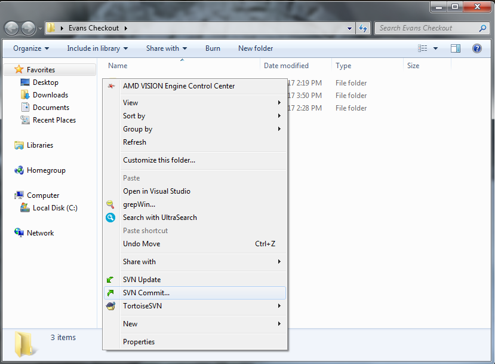
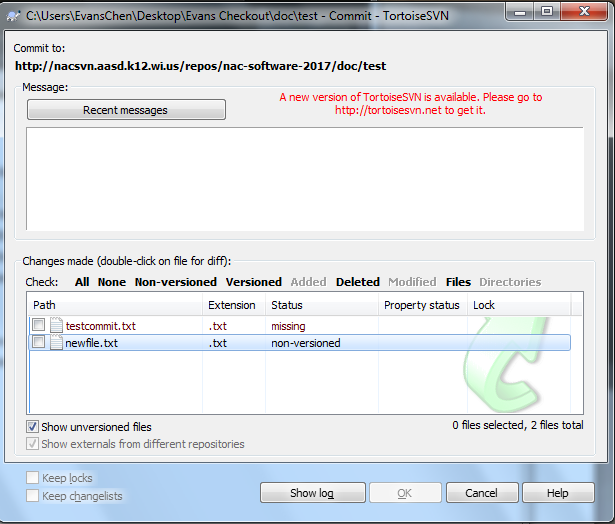
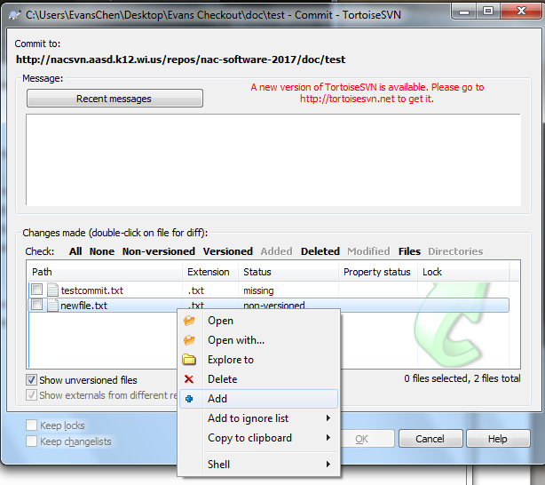
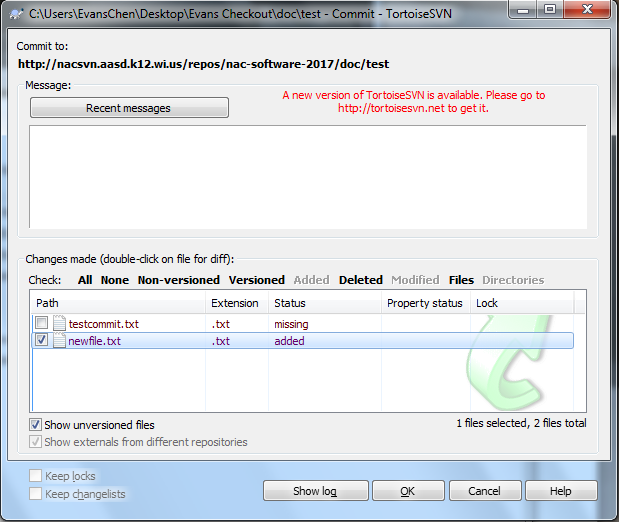
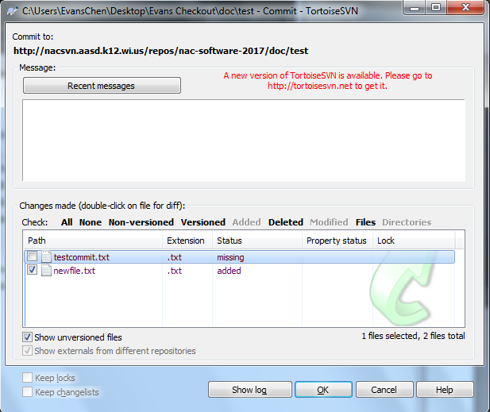
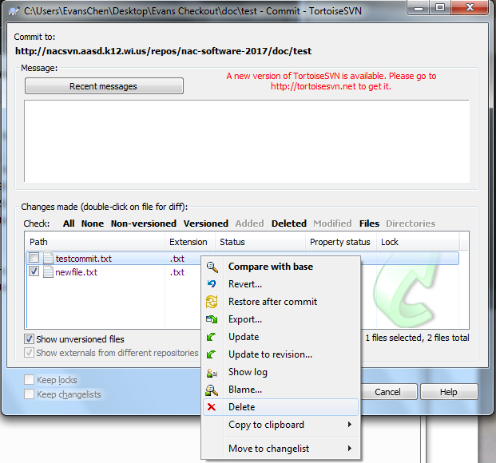
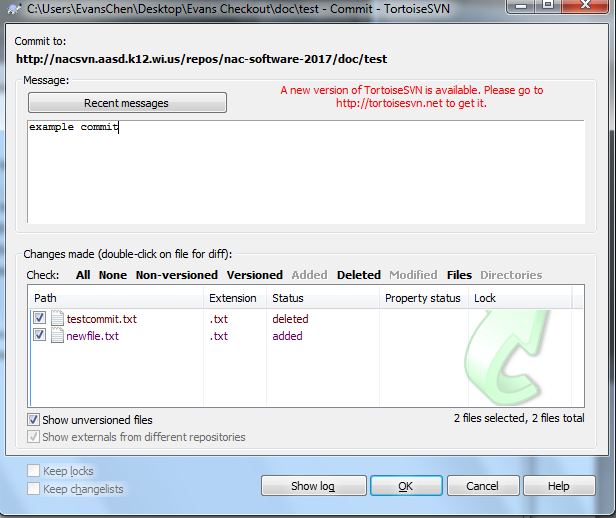
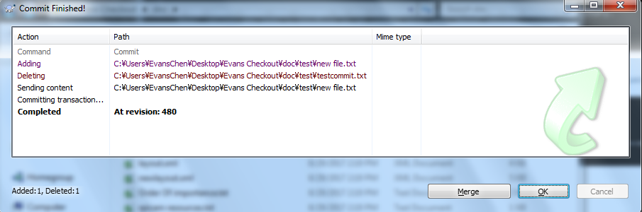

SVN Commit
==========

A SVN commit takes your changes to the checkout and posts them on the online repository. Then, anyone who does a checkout or an update also gets those changes.

After committing, your changes may later interfere with another person's changes when they try to SVN Update. This is called a `conflict <svnconflict.html>`_.

First, open the commit window by right clicking and selecting **SVN Commit**.

Before you press the OK button, make sure that you tell SVN about any files and folders that you created or deleted.

If you created a file, make sure that it is marked as **added**. If it is marked **non-versioned**, then you need to add it.

Right click the file, and choose **Add**.

If you deleted a file, make sure that it is marked as **deleted**. If it is marked **missing**, then you need to tell SVN that you deleted it.

Right click the file, and choose **Delete**.

Then, make sure to type a commit message describing what you changed. These messages should include what you changed, and why you changed it.

Example: Added the Drive subsystem, since it is needed to write Drive commands.

You may be asked to enter your credentials. Enter your SVN username and password. If you don't know yours, ask a software mentor (preferably Nick).

Then, it should successfully commit those changes.

One thing to note is that a commit will fail if you aren't connected to the internet. This commonly happens if the laptop has not gone through the school wifi's login process.

Another important thing to note is that when committing to trunk, no committed change should introduce errors that make the project unable to build.

.. toctree::
	:glob:
	:maxdepth: 10
	:caption: Contents