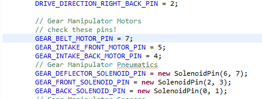

Resolving SVN Conflicts
=======================

A **conflict** occurs when two people try to edit the same file, but their changes can't both be made at the same time.

There are two types of conflicts: **file conflicts**, and **tree conflicts**.

File Conflicts
--------------

A file conflict occurs when two people edit the same line of a file. If one person then commits their change, then when the other person tries to SVN Update, the conflict will appear.

Example:
^^^^^^^^

Let's say there is this line of code:

.. image:: ./_static/conflict1.png
    :width: 60%

Some time later, Person A notices that this pin is incorrect in RobotMap. He then talks to electrical, and changes the pin from pin 6 to pin 7.

Then, Person A commits that change.

A bit later, Person B also notices the pin is wrong, and changes it from pin 6 to pin 8, which is his best guess as to what the real pin might be.

When he tries to SVN update, however, he will be met with this error message:

Double click the **Conflicted** entry to open the merging software.

Here, you can see the two edits that were made. One changes the pin number to 7, and one changes the pin number to 8.

There are several options for merging:

 - Use this text block
    Uses the selected text block as the correct one.

 - Use this whole file
    Uses the selected file as the correct one.

 - Use text block from 'mine' before 'theirs'
    Use both the local and the repository's code blocks, with the local code block coming first.

 - Use text block from 'theirs' before 'mine'
    Use both the local and the repository's code blocks, with the repository's code block coming first.

Person B then goes to talk to Person A about whose code to use. Then, since Person A already talked to electrical and found out the correct pin, Person A's code should be used.

Thus, Person B selects Person A's text block, and chooses **Use this text block**. Since this is the only conflicting line in the file, there are no more conflicts, and the file can be **marked as resolved** by either saving or using the **Mark as resolved** green checkmark button at the top of the merging software.

After exiting out of the merging software, you can see that the conflict is no longer giving an error, and the update succeeded.

.. image:: ./_static/conflict8.png
    :width: 100%

Tree Conflicts
--------------

A **tree conflict** occurs when a conflict involves the file tree. For example, if Person A edits a file, but Person B deletes or renames it, then that is a tree conflict, since the file that Person A edited is missing from the file tree.

Example:
^^^^^^^^

Let's say Person A trying to keep track of the dimensions of the game field by storing the game field data in a text file.

Person A then edits the file so that it has the correct dimensions.

However, at the same time, Person B realizes that there are two text files containing the field's dimensions, one of which is old and was used for a previous competition.

In this case, the file "Field Dimensions.txt" is the old one, and should no longer be used. Instead, people should be using "Field Dimensions. St. Louis.txt". So, to avoid confusion, Person B deletes the old "Field Dimensions.txt". He then commits his change.

However, Person B is too late since Person A has already modified "Field Dimensions.txt". So, when Person A tries to SVN update, he gets this error message:

This tree conflict alerts him that he changed "Field Dimensions.txt", but that file no longer exists since Person B deleted it.

Clicking on the conflict gives this window:

If it is correct to disregard the repository's state and continue with your local copy, you can click **Accept current working copy state (mark as resolved)**. In this example, however, this is not the case, since Person A modified the old file where Person A should have modified the new one.

Instead, Person A should `revert <svnrevert.html>`_ their changes so that the "Field Dimensions.txt" file gets deleted. This resolves the conflict, since now, the file is deleted on both the local and repository's copy of the code.

.. image:: ./_static/treeconflict8.png
    :width: 100%

Since the conflict is resolved, SVN Update now works again.

.. toctree::
	:glob:
	:maxdepth: 10
	:caption: Contents