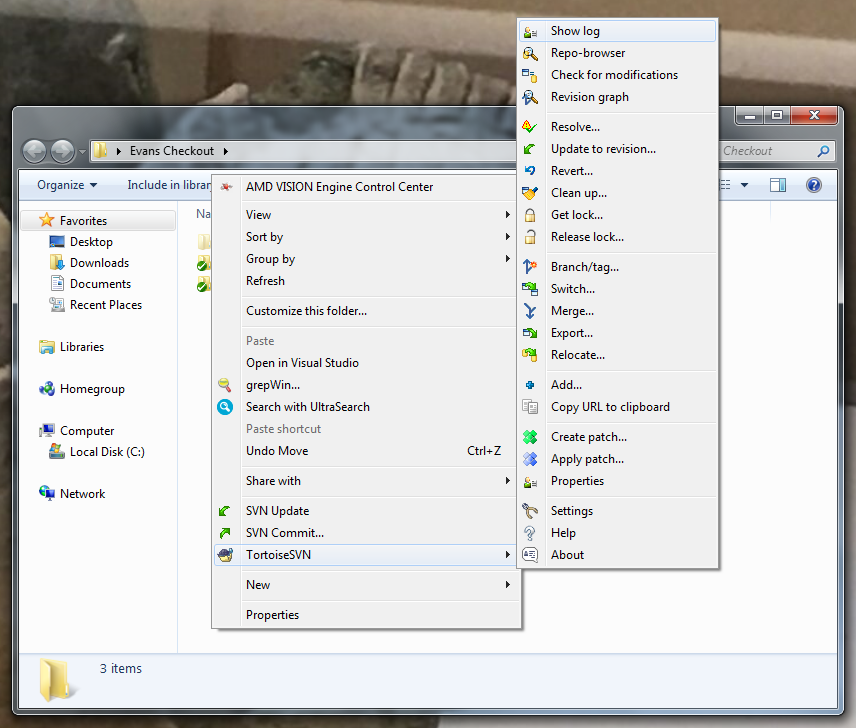
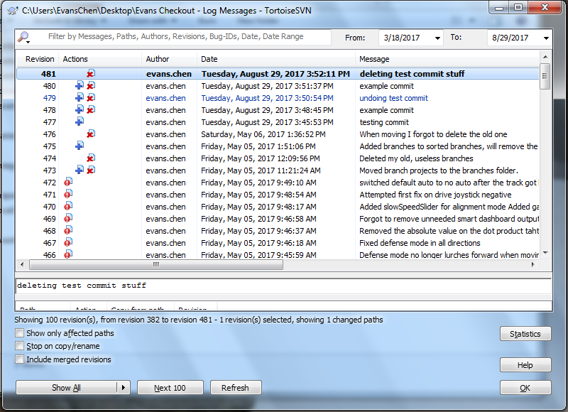
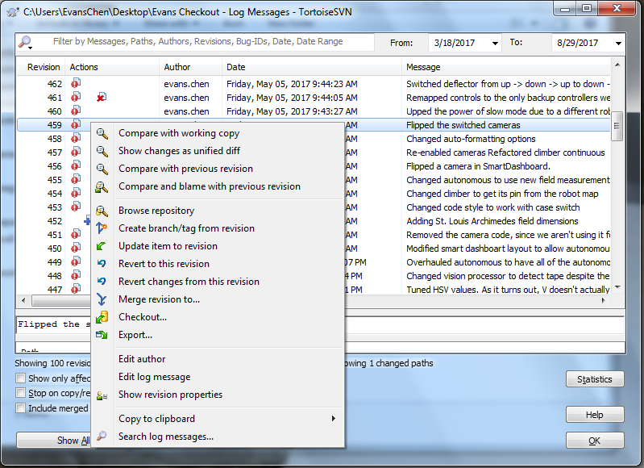
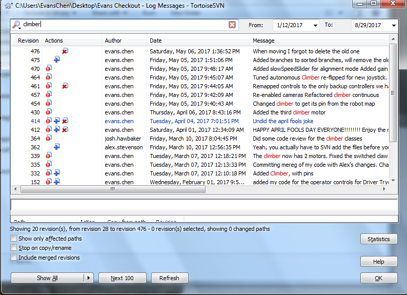

Viewing SVN Logs
================

You can look at all of the changes made so far using the SVN Log.

The SVN log is accessed by right clicking, and hovering over **TortoiseSVN** to open up the TortoiseSVN menu. Then, click on **Show log**.

The log will then open up. Here, you can look at every revision made to the repository. If not all of them show up, you can click the **Show All** button in the bottom left to show all of the revisions.

Additionally, you can right click any revision to get a menu of what you can do with that revision.

Here is a list of the possible things you can do with each revision:

 - Compare with working copy
    This compares the selected revision with your current workspace.

 - Show changes as unified diff
    Shows all of the revision's changes in one file. This isn't really used that often.

 - Compare with previous version
    This compares the selected revision with the previous revision, showing what that revision changed.

 - Compare and blame with previous revision
    Shows the last editor of each line. This is useful for figuring out who changed what line, which is why it's called "blame".

 - Browse repository
    Opens the repo browser for that revision.

 - Create branch/tag from revision
    Similar to the normal TortoiseSVN branch/tag, except it uses the selected revision instead of the local checkout.

 - Update item to revision
    This the same as using **Update to Revision**.

 - Revert to this revision
    Takes the local checkout and adds modifications to it so that it is the same as the selected revision.

 - Revert changes from this revision
    Takes the local checkout and removes all changes that the selected revision made.

 - Merge revision to...
    Used when merging branches to the trunk.

The rest are relatively self explanatory.

Lastly, you can search and filter the revisions so that it's easier to find the one you want.

.. toctree::
	:glob:
	:maxdepth: 10
	:caption: Contents