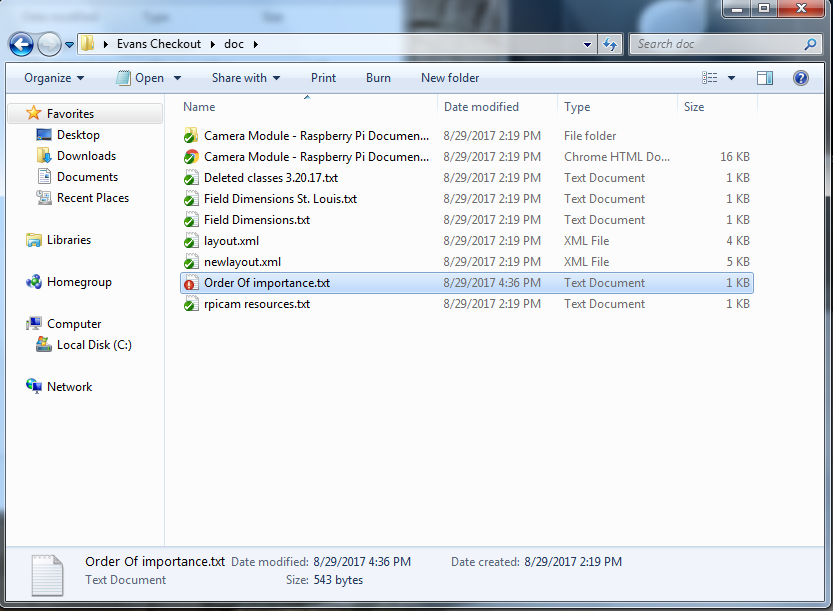
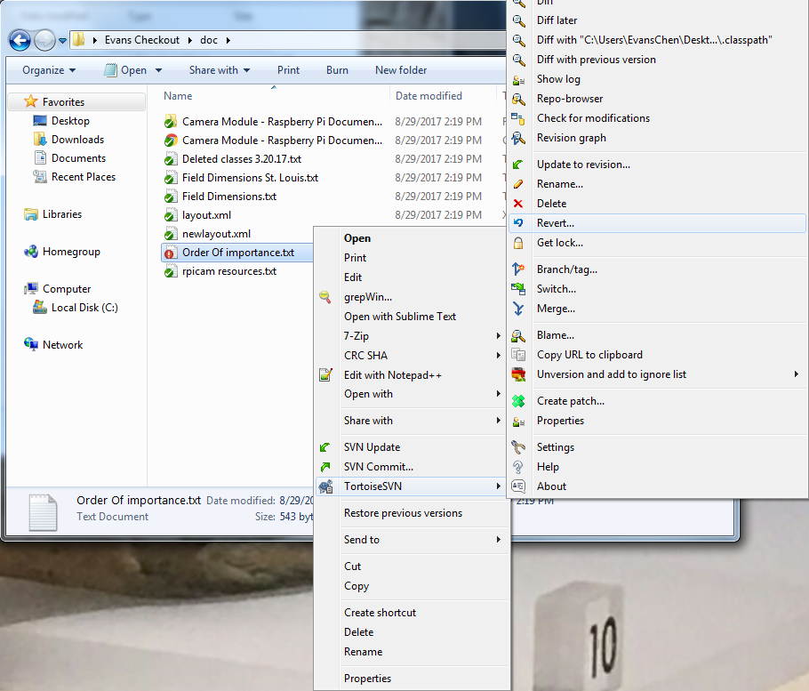
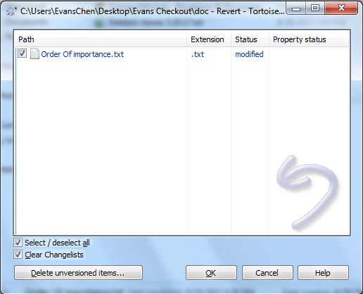
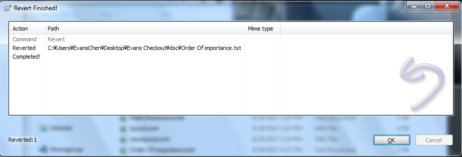

SVN Revert
==========

An SVN Revert removes all uncommitted local changes to the checkout. This is useful for undoing accidental changes that have not yet been committed.

If a change is already committed, **Revert changes from this Revision** in the `SVN Log <svnlog.html>`_ must be used.

Firstly, select the file or folder you want to revert.

Right click and hover over **TortoiseSVN**, opening the TortoiseSVN menu. Then, select **Revert...**

Check the subfiles that you want to revert.

Then, click OK and the revert should complete. Those files should now only contain committed changes, and no local changes.

An important thing to note is that if a checkout is not working correctly and there are no important edits to preserve, one good step to take is to `SVN Cleanup <svncleanup.html>`_ and then SVN Revert. This usually resolves issues with the checkout, since it essentially turns it back into a clean checkout.

.. toctree::
	:glob:
	:maxdepth: 10
	:caption: Contents