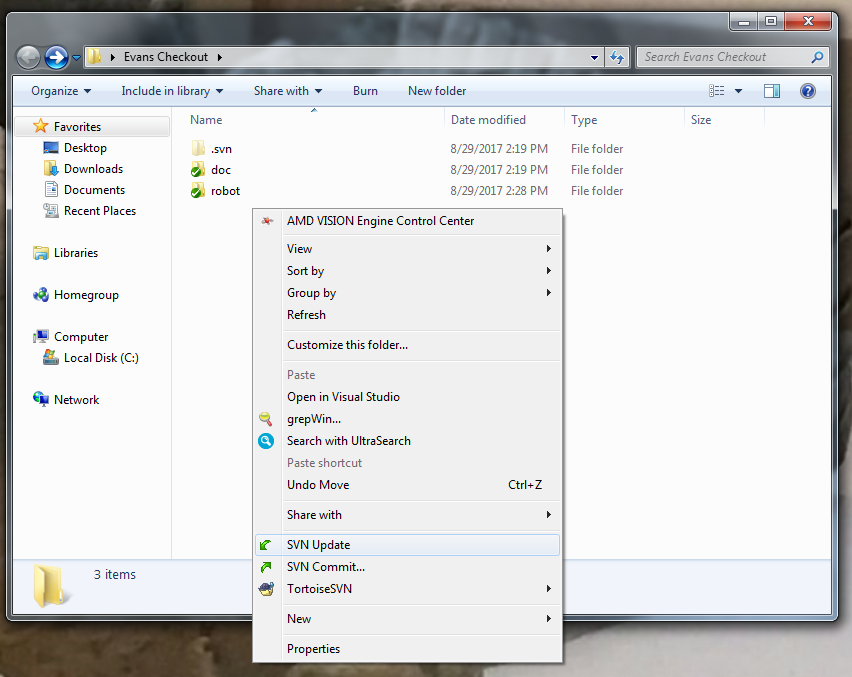
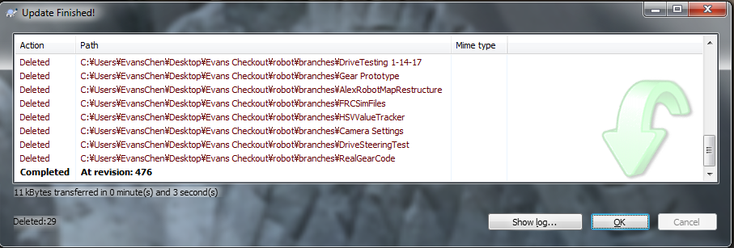

SVN Update
==========

An SVN Update takes committed changes from other checkouts and adds them to your checkout of the repository. However, your local changes are still kept, which may lead to `conflicts <svnconflict.html>`_ if someone else commits a change that modifies the same line as is modified locally.

After creating an SVN checkout, other people's changes will not be added to the checkout unless you SVN Update. So, to keep the checkout up to date, you must regularly SVN Update.

Additionally, if a checkout is not up to date, the repository may stop you from committing until it is updated.

Updating is simple. Simply right click to open the context menu after selecting the checkout, and click SVN Update.

.. toctree::
	:glob:
	:maxdepth: 10
	:caption: Contents