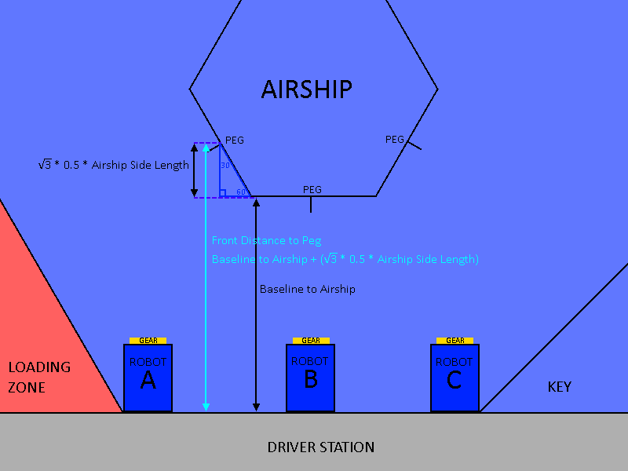

Autonomous example
==================

This article examines 2017's autonomous code. It serves as both an example of what autonomous code might look like as well as a tutorial on how to implement an autonomous chooser, since autonomous will almost always need a chooser anyway.

The design of 2017's robot is that it is composed of three subsystems: the Drive, the Climber, and the Gear Manipulator. However, in this game, since climbing can only happen at the end of the match, not in the autonomous period in the beginning, the climber will not play a role in this example.

For the purposes of simplicity, although the 2017 robot had a swerve drive, since its autonomous only used tank drive functionality (DriveForwards and TurnToAngle), its drive subsystem will be treated like a tank drive.

1. Find out what commands you have
^^^^^^^^^^^^^^^^^^^^^^^^^^^^^^^^^^

Here, the commands that are usable in autonomous will be listed. Commands used only in teleop mode, such as DriveContinuous, will not be listed.

Drive Commands:

 - DriveForwards(double distance)
    Drives the robot forward a given number of encoder ticks. There are 10.25 encoder ticks per inch. A negative value can be passed in to make the robot drive backwards.

 - TurnToAngle(double angle)
    Turns the robot to a given angle, relative to its starting angle. For example, if 30.0 is passed in, it will turn to 30 degrees counterclockwise of the angle it started at.

Gear Manipulator Commands

 - MoveGearSafe(GearLocation location)
    Moves the gear manipulator to a specified GearLocation along the track by turning the belt motor. GearLocation includes BOTTOM_BACK, BOTTOM_FRONT, PEG, and CHUTE.

 - OpenClaw()
    Opens the claw, releasing the gear

 - CloseClaw()
    Closes the claw.

2. Make and write the autonomous plans
^^^^^^^^^^^^^^^^^^^^^^^^^^^^^^^^^^^^^^

If you're unfamiliar with 2017's game, see the `2017 FIRST Robotics Competition STEAMWORKS Game Animation <https://www.youtube.com/watch?v=EMiNmJW7enI>`_.

Note that each robot starts with a gear. We want to deliver this gear to a peg, so that it can score points. We start the game by having our gear in the gear manipulator.

Also, in autonomous, the robot cannot cross over to the other side of the field. So, we only care about our side of the field in this situation.

Here's a map of one side of the field:
**************************************

Now, for the field dimensions:
******************************

Measurements for each length:

 - Robot Length: 41 inches
 - Robot Width: 36 inches
 - Airship Side Length: 40 inches
 - Baseline to Airship: 114 inches
 - Center to Key: 54 inches
 - Center to Loading Zone: 78 inches

Now, note that there are 3 different starting positions. For each of the starting positions, there needs to be an autonomous plan that covers how to place a gear in that position.

Plan for Position B:
********************

We're going to start with position B, since the plan for position B is the simplest. The peg is directly in front of the robot.

Also, here, you can see that the distance we need to drive forwards is:

.. code-block:: java

    (Baseline to Airship) - (Robot Length)

So, all we need to do now is move the gear to the peg's height, drive forwards by the correct distance, open the claw to release the gear, then back up the length of the peg so that the gear can be pulled up.

So, our autonomous plan would be:

.. code-block:: java

    addSequential(new MoveGearSafe(GearLocation.PEG));
    addSequential(new DriveForwards(BASELINE_TO_AIRSHIP - ROBOT_LENGTH);
    addSequential(new OpenClaw());
    addSequential(new DriveForwards(-PEG_LENGTH);

Plan for Position A:
********************

Next up is the autonomous plan for position A. This one is a bit more complicated.

Since the robot can only really place the gear on the peg when perpendicular to the airship wall, the robot will have to approach the peg at an angle of -60°. This angle is negative since counterclockwise is the positive direction, and the robot in this case must be rotated clockwise.

Thus, our plan is to go forward to line up the robot, then turn to -60° and then go place the gear.

However, we need to calculate the Forward Distance and the Turned Distance.

First, let's figure out where the peg is in relation to the robot at that position.

To determine how far to the right the peg is:

First, let's determine the robot's left/right position. We consider the robot's position to be the center of the robot, so, relative to the center of the field, the robot is at:

.. code-block:: java

    double ROBOT_RIGHTWARD_POSITION = CENTER_TO_LOADING_ZONE - (0.5 * ROBOT_WIDTH);

This is because it's at the loading zone, except to account for the position at the center of the robot, half of the width is subtracted off.

Then, about the position of the peg, we know the size of the airship. So, using that and the 30-60-90 triangle rules, we can find that the left/right position of the peg at:

.. code-block:: java

    double PEG_RIGHTWARD_POSITION = (0.5 * AIRSHIP_SIDE_LENGTH) + (0.5 * 0.5 * AIRSHIP_SIDE_LENGTH);

This is the same as:

.. code-block:: java

    double PEG_RIGHTWARD_POSITION = 0.75 * AIRSHIP_SIDE_LENGTH;

Now, to find the distance between the two positions, take the robot's position and subtract the peg's position.

.. code-block:: java

    double PEG_RIGHTWARD_POSITION = CENTER_TO_LOADING_ZONE - (0.5 * ROBOT_WIDTH) - (0.75 * AIRSHIP_SIDE_LENGTH);

This is confirmed visually by the graphic.

Now, for the peg's forward position from the robot:

This is a bit easier to find. Simply start with the distance from the baseline to the airship, and then add the distance from the closest airship edge to the peg.

.. code-block:: java

    double PEG_FORWARD_POSITION = BASELINE_TO_AIRSHIP + (Math.sqrt(3) * 0.5 * AIRSHIP_SIDE_LENGTH);

Now, since we know the peg's position, we can calculate the autonomous plan's Forward Distance and Turned Distance.

First, notice that the Turned Distance, by the 30-60-90 triangle rule, is:

.. code-block:: java

    double TURNED_DISTANCE = PEG_RIGHTWARD_POSITION * 2 / Math.sqrt(3);

Then, for forward position, note that it is simply the Peg Forward position, except with half of the robot length subtracted off (since the center of the robot is in the middle) and then with another (PEG_RIGHTWARD_POSITION / Math.sqrt(3)) to account for the forward distance traveled after turning -60°.

Hence, the forward distance is:

.. code-block:: java

    double FORWARD_DISTANCE = PEG_FORWARD_POSITION - (0.5 * ROBOT_LENGTH) - (PEG_RIGHTWARD_POSITION / Math.sqrt(3));

Now, since the distances have been calculated, the only thing left is to plug them into the autonomous plan:

.. code-block:: java
    
    addSequential(new MoveGearSafe(GearLocation.PEG));
    addSequential(new DriveForward(FORWARD_DISTANCE));
    addSequential(new TurnToAngle(-60.0));
    addSequential(new DriveForward(TURNED_DISTANCE));
    addSequential(new OpenClaw());
    addSequential(new DriveForwards(-PEG_LENGTH);

Plan for Position C:
********************

An important thing to note about the position C autonomous plan is that it is extremely similar to position A's autonomous plan. The only differences are that the robot turns to 60° instead of -60°, and that when finding the Robot's rightward position similar to in plan A, instead of:

.. code-block:: java

    double ROBOT_RIGHTWARD_POSITION = CENTER_TO_LOADING_ZONE - (0.5 * ROBOT_WIDTH);

use:

.. code-block:: java

    double ROBOT_RIGHTWARD_POSITION = CENTER_TO_KEY - (0.5 * ROBOT_WIDTH);

since we are starting by the key instead of the loading zone. All other formulas and commands remain the same.

3. Implementing an Autonomous Chooser
^^^^^^^^^^^^^^^^^^^^^^^^^^^^^^^^^^^^^

Now, we have 3 different autonomous plans, so we must give the driver a way to choose between them.

First, create an enum that will represent each plan.

.. code-block:: java

    public enum Plan
    {
        POSITION_A, POSITION_B, POSITION_C;
    }

Now, in the command group's constructor, make it so that a Plan must be passed in.

.. code-block:: java

    public Autonomous(Plan plan)
    {

    }

Then, add a switch statement that uses the plan.

.. code-block:: java

    public Autonomous(Plan plan)
    {
        switch(plan)
        {
            case POSITION_A:
                break;

            case POSITION_B:
                break;

            case POSITION_C:
                break;

            default:
                break;
        }
    }

Now, plug in the autonomous plans into the switch statement.

.. code-block:: java

    public Autonomous(Plan plan)
    {
        switch(plan)
        {
            case POSITION_A:

                double PEG_RIGHTWARD_POSITION = CENTER_TO_LOADING_ZONE - (0.5 * ROBOT_WIDTH) - (0.75 * AIRSHIP_SIDE_LENGTH);
                double PEG_FORWARD_POSITION = BASELINE_TO_AIRSHIP + (Math.sqrt(3) * 0.5 * AIRSHIP_SIDE_LENGTH);

                double TURNED_DISTANCE = PEG_RIGHTWARD_POSITION * 2 / Math.sqrt(3);
                double FORWARD_DISTANCE = PEG_FORWARD_POSITION - (0.5 * ROBOT_LENGTH) - (PEG_RIGHTWARD_POSITION / Math.sqrt(3));

                addSequential(new MoveGearSafe(GearLocation.PEG));
                addSequential(new DriveForward(FORWARD_DISTANCE));
                addSequential(new TurnToAngle(-60.0));
                addSequential(new DriveForward(TURNED_DISTANCE));
                addSequential(new OpenClaw());
                addSequential(new DriveForwards(-PEG_LENGTH);

                break;

            case POSITION_B:

                addSequential(new MoveGearSafe(GearLocation.PEG));
                addSequential(new DriveForwards(BASELINE_TO_AIRSHIP - ROBOT_LENGTH);
                addSequential(new OpenClaw());
                addSequential(new DriveForwards(-PEG_LENGTH);

                break;

            case POSITION_C:

                double PEG_RIGHTWARD_POSITION = CENTER_TO_KEY - (0.5 * ROBOT_WIDTH) - (0.75 * AIRSHIP_SIDE_LENGTH);
                double PEG_FORWARD_POSITION = BASELINE_TO_AIRSHIP + (Math.sqrt(3) * 0.5 * AIRSHIP_SIDE_LENGTH);

                double TURNED_DISTANCE = PEG_RIGHTWARD_POSITION * 2 / Math.sqrt(3);
                double FORWARD_DISTANCE = PEG_FORWARD_POSITION - (0.5 * ROBOT_LENGTH) - (PEG_RIGHTWARD_POSITION / Math.sqrt(3));

                addSequential(new MoveGearSafe(GearLocation.PEG));
                addSequential(new DriveForward(FORWARD_DISTANCE));
                addSequential(new TurnToAngle(60.0));
                addSequential(new DriveForward(TURNED_DISTANCE));
                addSequential(new OpenClaw());
                addSequential(new DriveForwards(-PEG_LENGTH);

                break;

            default:
                break;
        }
    }

If autonomous plans get more complex, you may want to instead use multiple command groups in a package instead of cramming them all into one command with a switch statement. A giant switch statement is almost always not an elegant solution.

Now, go into the Robot class. Firstly, add a SendableChooser.

In the class, declare the chooser:

.. code-block:: java

    SendableChooser<Command> chooser;

In robotInit, make sure to construct the chooser and add the autonomous plans to it:

.. code-block:: java
    :emphasize-lines: 14,15,16,17,19

    /**
     * This function is run when the robot is first started up and should be
     * used for any initialization code.
     */
    @Override
    public void robotInit()
    {
        drive = new Drive();
        gearManipulator = new GearManipulator();
        climber = new Climber();
        // initialized more last since it uses all the commands
        oi = new OI();

        // init auto commands
        chooser.addDefault("Auto Plan Position A", new Autonomous(Plan.POSITION_A));
        chooser.addObject("Auto Plan Position B", new Autonomous(Plan.POSITION_B));
        chooser.addObject("Auto Plan Position C", new Autonomous(Plan.POSITION_C));

        SmartDashboard.putData("Autonomous Plan", chooser);
    }

Then, in autonomousInit(), make sure to start the chosen command:

.. code-block:: java
    :emphasize-lines: 4,5

    @Override
    public void autonomousInit()
    {
        autonomousCommand = chooser.getSelected();
        autonomousCommand.start();
    }

Then, if this example was real, you would open SmartDashboard and start the robot. SmartDashboard would have the autonomous chooser, and the robot would perform whichever plan is selected once it starts autonomous mode.

.. toctree::
	:glob:
	:maxdepth: 10
	:caption: Contents
	
	