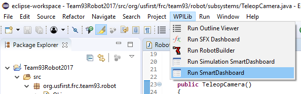
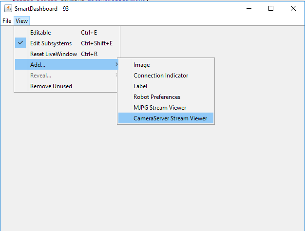
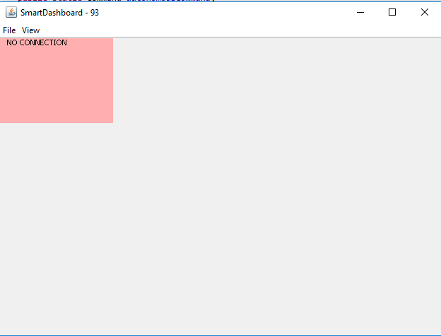
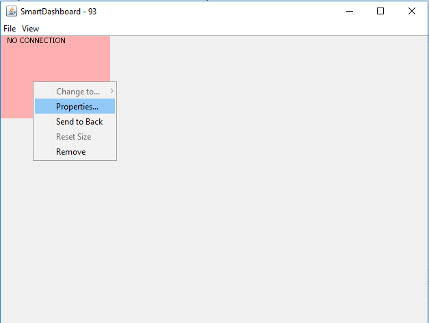
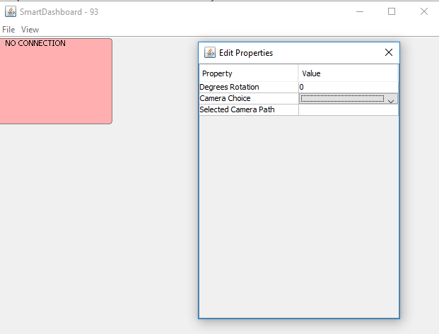

Teleop Camera
=============

A teleop camera is simply a USB camera that is mounted on the robot, which streams video to the SmartDashboard. Using a teleop camera, the drivers can see the surroundings of the robot even when their view from the driver station is obstructed.

One important fact to keep in mind when using teleop cameras is that each robot is only allowed to use 7 Mbps of bandwidth during matches. This means that, if a camera's stream takes up too much bandwidth, the controls from the drivers may not be able to correctly reach the robot, causing the robot to be undrivable. Hence, the number of cameras that can be used, as well as their quality and framerate, is limited by bandwidth.

Code implementation
-------------------

In this example we will be streaming from two USB cameras plugged in to the RoboRIO.

Although it is possible to stick all of the teleop camera code in the Robot class, this is not recommended, due to the clutter it causes. Instead, teleop camera code should be located in its own subsystem.

Firstly, create the subsystem file.

.. code-block:: java

    /**
     * Teleop Camera subsystem
     */
    public class TeleopCamera extends Subsystem {

        // Put methods for controlling this subsystem
        // here. Call these from Commands.

        public void initDefaultCommand() {
            // Set the default command for a subsystem here.
            //setDefaultCommand(new MySpecialCommand());
        }
    }

USB cameras are represented using the UsbCamera class. Add these to the subsystem class.

.. code-block:: java
    :emphasize-lines: 6,7

    /**
     * Teleop Camera subsystem
     */
    public class TeleopCamera extends Subsystem {

        public UsbCamera frontCamera;
        public UsbCamera backCamera;

        public void initDefaultCommand()
        {
        }
    }

Create a constructor. We will initialize the UsbCameras in the constructor.

.. code-block:: java
    :emphasize-lines: 9,10,11,12

    /**
     * Teleop Camera subsystem
     */
    public class TeleopCamera extends Subsystem {

        public UsbCamera frontCamera;
        public UsbCamera backCamera;
        
        public TeleopCamera()
        {

        }

        public void initDefaultCommand()
        {
        }
    }

Then, to initialize the UsbCameras:

.. code-block:: java
    :emphasize-lines: 11,12,13,14,15,16,18,19,20,21,22,23

    /**
     * Teleop Camera subsystem
     */
    public class TeleopCamera extends Subsystem {

        public UsbCamera frontCamera;
        public UsbCamera backCamera;
        
        public TeleopCamera()
        {
            // start capture from the camera at the front plugged into USB slot 0
            frontCamera = CameraServer.getInstance().startAutomaticCapture(0);
            // set the stream's resolution to 320x240
            frontCamera.setResolution(320, 240);
            // set the stream's frames per second to 15
            frontCamera.setFPS(15);
            
            // start capture from the camera at the back plugged into USB slot 1
            backCamera = CameraServer.getInstance().startAutomaticCapture(1);
            // set the stream's resolution to 160x120
            backCamera.setResolution(160, 120);
            // set the stream's frames per second to 10
            backCamera.setFPS(10);
        }

        public void initDefaultCommand()
        {
        }
    }

There are more methods for adjusting settings related to UsbCamera, which you can find `here <http://first.wpi.edu/FRC/roborio/release/docs/java/edu/wpi/cscore/UsbCamera.html>`_.

Then, make sure you declare and initialize this subsystem in Robot:

.. code-block:: java
    :emphasize-lines: 1,10

    TeleopCamera teleopCamera;

	/**
	 * This function is run when the robot is first started up and should be used
	 * for any initialization code.
	 */
	@Override
	public void robotInit()
	{
        teleopCamera = new TeleopCamera();
    }

Then, that's all there is to the robot code portion. If this is run on a robot, however, nothing will happen, since you also have to open the camera stream in SmartDashboard.

Opening the camera stream in SmartDashboard
-------------------------------------------

First, open up SmartDashboard.

Then, once you have SmartDashboard open, select **View** -> **Add...** -> **CameraServer Stream Viewer**.

This will create a video frame that shows the camera feed. If it can't reach the robot or the camera isn't connected, however, it will show *NO CONNECTION*.

If you create more than one CameraServer Stream Viewer, you will find that they all show the same camera feed, since they all stream from camera 0. The way to change which camera a video frame is streaming from is to go to its properties:

Opening its properties, we can see a field called **Camera Choice**. If a robot with multiple cameras is connected, we are able to choose which camera (for example, USB0 or USB1) that we want to stream from.

If a CameraServer Stream Viewer does not let you right click it to open the properties menu, then try hitting Ctrl-E to toggle to **Editable** setting.

Now, if the robot is connected, those video frames should stream from the USB cameras on the robot, giving the drivers a better view of what's going on.

.. toctree::
	:glob:
	:maxdepth: 10
	:caption: Contents

