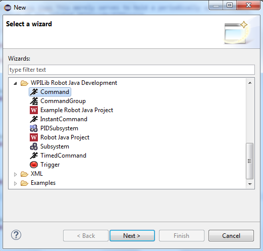

Creating a Command
==================

This article covers how to write a command, given a task. For more details on what a command is, see `Commands <./../../robotcode/structure/commands.html>`_.

Preparation
-----------

1. Find out what components you have
^^^^^^^^^^^^^^^^^^^^^^^^^^^^^^^^^^^^

Before you write a command, you need to know what you're working with. Unless the robot is already well understood, make sure to talk to design and electrical, and find out what motors, solenoids, and sensors you have to use, and how each part should function in your command.

If the design isn't ready yet, ask about the general workings of the robot, and try to squeeze out what you can. It's possible that many parts are confirmed, but some details are not.

2. Look at the subsystem
^^^^^^^^^^^^^^^^^^^^^^^^

It's not really possible to write a command without a subsystem that gives commands the ability to perform basic subsystem actions, so we must tackle that part first. Basic actions include motor setting, solenoid setting, sensor reading, and basic functions, BUT if any safety nets need to be implemented, they should be implemented here.

Look at the subsystem (or subsystems) that you are using, and determine what functionality needs to be added. For example, if you're writing a Drive command, and there aren't any motor setting methods in the Drive subsystem, you should add those. It's good practice to add a way to safely do any reasonable action the subsystem could have to do, but if you're short on time, you could just add only the functionality you directly need for the command.

Remember that you shouldn't be accessing the components in the subsystem directly. It is much better to write

.. code-block:: java

	Drive.setLeftMotors(0.5);

than

.. code-block:: java

	Drive.LEFT_FRONT_MOTOR.set(0.5);
	Drive.LEFT_BACK_MOTOR.set(0.5);

On writing a subsystem, it would be useful to visit the `Subsystems <../subsystems/subsystems.html>`_ page.

3. Make a plan
^^^^^^^^^^^^^^

Although it's easy to write simple commands, more complex commands may require flow charts and some whiteboard work, or just a lot of thinking. Programming should only really occur when you know how the command is going to work, and all you need is the implementation.

Here, you might even decide that a `CommandGroup <commandgroups.html>` is a better way to implement this action. Usually, any sequence of events, such as "Open the claw and then dispense the gear" or "Move the elevator up while driving forward" should use a command group.

One example of a plan might be:

..

	Goal: I want my command to be able to manually move an elevator up and down, except it will stop at the ends if a limit switch is pressed at either end as a safety net. If the joystick is pressed down, the safety net can be manually overrided.

	**if everything's normal:**
		**set the elevator motor power to the operator's joystick value**

	**if the top limit switch is pressed:**
		**if the motor is being powered in the upwards direction:**
			**make the motor power 0**

	**if the bottom limit switch is pressed:**
		**if the motor is being powered in the downwards direction:**
			**make the motor power 0**

	**if the joystick button is pressed:**
		**set the elevator motor power to the operator's joystick value regardless of anything else**

After the plan is complete, then you're ready to dive into actually writing the command.

Writing the Command
-------------------

1. Make the command's file
^^^^^^^^^^^^^^^^^^^^^^^^^^

Right click on the project and choose **New** -> **Other**.

Then, in the New window that appears, scroll down to **WPILib Robot Java Development** and choose **Command**.

Then, name your command.

Press **Finish**, and it should be created.

2. Write the command
^^^^^^^^^^^^^^^^^^^^

Now, it's time to actually write the command. Since this varies greatly from command to command, there isn't really any one clear formula for this. If you already have a plan, however, writing the command is simply just following the plan and calling on subsystem methods. See `Commands <./../../robotcode/structure/commands.html>`_ for what to put in each method, and follow these examples for guidance:

 - `Climber <examples/commands/climber.html>`_
 	Manual control of a motor that is programmed to never spin backwards.

 - `Tank Drive <examples/commands/tankdrive.html>`_
 	A basic tank drive. Left joystick controls the left wheels, right joystick controls the right wheels.

 - `Ball Acquisition <examples/commands/bacq.html>`_
 	A command that prevents balls from accidentally falling out of a claw using intake wheels.

 - `Open and Close a Claw <examples/commands/claw.html>`_
 	Opening or closing a claw using pneumatics.

 - `Moving an Elevator Manually <examples/commands/elevatormanual.html>`_
 	Raising and lowering an elevator subsystem, in between two limit switches marking the bottom and the top.

 - `Driving Forward a Certain Distance <examples/commands/drivesetpoint.html>`_
 	Accurately driving the robot forwards to a certain distance using encoders and a PIDController.

 - `Rotating a Claw both Manually and using Setpoints <examples/commands/aimclaw.html>`_
 	Two commands that interact to give an operator both manual and setpoint control of a rotating claw that can only rotate between two limits in a safe way, using a Potentiometer and a PIDController.

List of example commands:

.. toctree::
	:glob:
	:maxdepth: 10
	
	examples/commandexamples

3. Running the command
^^^^^^^^^^^^^^^^^^^^^^

Now that the command is all written, the robot has to run it. There are several different ways to run a command:

 - If the command should be linked to a driver/operator button press:

 	This way of running a command is used if the command should be under direct control of the driver/operator.

 	This is done by creating a button on a joystick:

 	.. code-block:: java

 		Button joystickA = new JoystickButton(driver, 1);

 	and then, linking the command to the button:

 	.. code-block:: java

 		joystickA.whenPressed(new YourCommandNameHere());

 	Then, any time the button is pressed, the command will start.

 - If the command is linked to a subsystem, and should always be running unless something else is using the subsystem:

 	Running a command by making it a subsystem's default command is used for commands that are tightly linked to their subsystems and should almost always be running, unless something more important is using the subsystem. Examples include DriveContinuous and ManualElevatorControl commands, since, for example, we usually want the driver in control of the robot by default. Remember that a subsystem can only have one default command.

 	This is done by adding to the initDefaultCommand() method in a subsystem:

 	.. code-block:: java

 		@Override
		public void initDefaultCommand()
		{
		    setDefaultCommand(new YourCommandNameHere());
		}

 - If the command should be started once at the beginning of autonomous or teleop mode and never again or it never ends or should be interrupted:

 	Manually starting a command is very rarely useful, but sometimes useful in a pinch or for autonomous reasons, although we use CommandGroups for that anyway.

 	This is done by writing:

 	.. code-block:: java

 		Command yourCommandNameHere = new YourCommandNameHere();
 		yourCommandNameHere.start();

 	Then, when the command needs to be canceled, use:

 	.. code-block:: java

 		yourCommandNameHere.cancel();

And that's it! All that's left is to test the command until you're sure it works.