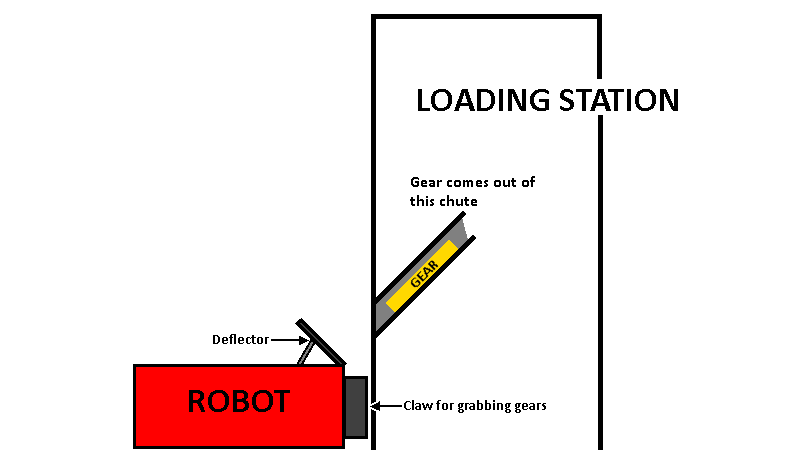

Deflector Flip
==============

This example discusses a subsystem called a *Deflector*. It may be hard to visualize this, so here is an animation describing how it works:

The gear comes down the chute, but there is a deflector to make sure it doesn't land on the top of the robot. But since the gear can get stuck on that deflector, there is a pneumatic cylinder that can push the deflector up to dislodge the gear.

Design
------

In this example, the design of the deflector is a piece of plastic, with a pneumatic cylinder hooked up to a double action solenoid.

Setting the solenoid to forwards causes the deflector to go upwards, and setting the solenoid to reverse causes the deflector to go downwards.

When the operator presses the START button, the deflector should go up, wait 0.25 seconds, and then come back down.

Subsystem methods
-----------------

This guide assumes that there already is a Deflector subsystem, and to set the deflector solenoid, you simply need to write:

.. code-block:: java

	Deflector.DEFLECTOR_SOLENOID.set(DoubleSolenoid.Value.kForward);

We also assume that there are already commands called DeflectorUp and DeflectorDown that set the deflector up and down, respectively. These commands can be as simple as:

.. code-block:: java

    public class DeflectorUp extends InstantCommand
    {
        public DeflectorUp()
        {
            super();
            // Use requires() here to declare subsystem dependencies
            requires(Robot.deflector);
        }

        // Called once when the command executes
        protected void initialize()
        {
            Deflector.DEFLECTOR_SOLENOID.set(DoubleSolenoid.Value.kForward);
        }
    }

.. code-block:: java

    public class DeflectorDown extends InstantCommand
    {
        public DeflectorDown()
        {
            super();
            // Use requires() here to declare subsystem dependencies
            requires(Robot.deflector);
        }

        // Called once when the command executes
        protected void initialize()
        {
            Deflector.DEFLECTOR_SOLENOID.set(DoubleSolenoid.Value.kReverse);
        }
    }

On how to create this subsystem, see `Creating a subsystem <./../../../subsystems/subsystems.html>`_.

We also assume that OI already has a Joystick named operator, and that the START button on the operator's controller is button 11.

On how to use OI, see `OI <./../../../../robotcode/structure/oi.html>`_.

Writing the command
-------------------

Once you create the DeflectorFlip command group, you'll get a blank command group template like this:

.. code-block:: java

	package org.usfirst.frc.team93.robot.commands;

	import edu.wpi.first.wpilibj.command.CommandGroup;

	/**
	 * 
	 */
	public class DeflectorFlip extends CommandGroup {

	    public DeflectorFlip() {
	        // Add Commands here:
	        // e.g. addSequential(new Command1());
	        //      addSequential(new Command2());
	        // these will run in order.

	        // To run multiple commands at the same time,
	        // use addParallel()
	        // e.g. addParallel(new Command1());
	        //      addSequential(new Command2());
	        // Command1 and Command2 will run in parallel.

	        // A command group will require all of the subsystems that each member
	        // would require.
	        // e.g. if Command1 requires chassis, and Command2 requires arm,
	        // a CommandGroup containing them would require both the chassis and the
	        // arm.
	    }
	}

In the javadoc at the top, describe what this command does.

.. code-block:: java

	/**
	 * This command group sets the deflector up for 0.25 seconds, and then sets it back down.
	 * It is designed to dislodge gears off of the deflector.
	 */

Then, the constructor is where all of the command adding goes. We need to set the deflector up, wait 0.25 seconds, and then set the deflector down. This can be accomplished using the DeflectorUp(), WaitCommand(0.25), and DeflectorDown() commands. And, since we want to execute these one after the other, we use addSequential for all of these.

You can also delete the autogenerated comments in the body of the constructor if you like.

Now, your command instead looks like this:

.. code-block:: java

    package org.usfirst.frc.team93.robot.commands;

    import edu.wpi.first.wpilibj.command.CommandGroup;

    /**
     * This command group sets the deflector up for 0.25 seconds, and then sets it back down.
     * It is designed to dislodge gears off of the deflector.
     */
    public class DeflectorFlip extends CommandGroup
    {
        public DeflectorFlip()
        {
            addSequential(DeflectorUp());
            addSequential(WaitCommand(0.25));
            addSequential(DeflectorDown());
        }
    }

That's all there is to the command group. It's done.

Running the command
-------------------

Now, go into the OI class. We need to set the DeflectorFlip command to run whenever the operator presses the START button.

.. code-block:: java
	:emphasize-lines: 9,10

	public static Joystick driver;
	public static Joystick operator;

	public OI()
	{
	    driver = new Joystick(0);
	    operator = new Joystick(1);

	    Button deflectorFlipButton = new JoystickButton(operator, 11); // START button
	    deflectorFlipButton.whenPressed(new DeflectorFlip());
	}

And that's it! Now, whenever the operator presses START, the deflector will flip up and down, and dislodge any gear stuck on it.

Final code
----------

DeflectorFlip
^^^^^^^^^^^^^

.. code-block:: java

    package org.usfirst.frc.team93.robot.commands;

    import edu.wpi.first.wpilibj.command.CommandGroup;

    /**
     * This command group sets the deflector up for 0.25 seconds, and then sets it back down.
     * It is designed to dislodge gears off of the deflector.
     */
    public class DeflectorFlip extends CommandGroup
    {
        public DeflectorFlip()
        {
            addSequential(DeflectorUp());
            addSequential(WaitCommand(0.25));
            addSequential(DeflectorDown());
        }
    }

DeflectorUp
^^^^^^^^^^^

.. code-block:: java

    public class DeflectorUp extends InstantCommand
    {
        public DeflectorUp()
        {
            super();
            // Use requires() here to declare subsystem dependencies
            requires(Robot.deflector);
        }

        // Called once when the command executes
        protected void initialize()
        {
            Deflector.DEFLECTOR_SOLENOID.set(DoubleSolenoid.Value.kForward);
        }
    }

DeflectorDown
^^^^^^^^^^^^^

.. code-block:: java

    public class DeflectorDown extends InstantCommand
    {
        public DeflectorDown()
        {
            super();
            // Use requires() here to declare subsystem dependencies
            requires(Robot.deflector);
        }

        // Called once when the command executes
        protected void initialize()
        {
            Deflector.DEFLECTOR_SOLENOID.set(DoubleSolenoid.Value.kReverse);
        }
    }

.. toctree::
	:glob:
	:maxdepth: 10
	:caption: Contents
	
	