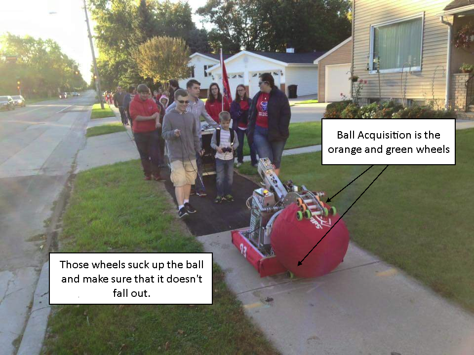

Ball Acquisition
================

This example describes the wheels on a robot's claw. This robot has a claw designed for picking up exercise balls, but to get the ball into the claw, it has a set of friction wheels that sucks in the ball.

Design
------

The design of this ball acquisition system includes 4 motors, each which are linked to a set of friction wheels. These wheels can turn to suck in the ball, and keep it in the robot. There is also a limit switch that detects if the ball is inside the claw or not. That way, if the ball starts to fall out, then the limit switch will no longer be pressed, and if the limit switch is no longer pressed, we know to turn on the motors to suck the ball back in.

Subsystem methods
-----------------

This guide assumes that there already is a BallAcquisition subsystem, and to set the intake motors on either side of the claw, you simply need to write:

.. code-block:: java

	BallAcquisition.INTAKE_MOTORS_TOP.set(1.0);    // left
	BallAcquisition.INTAKE_MOTORS_BOTTOM.set(1.0); // right

Additionally, the limit switch is accessible using:

.. code-block:: java

	BallAcquisition.hasBall()

On how to create this subsystem, see `Creating a subsystem <./../../../subsystems/subsystems.html>`_.

We also assume that OI already has a Joystick named operator, which has an X button which is seen as button number 4.

On how to use OI, see `OI <./../../../../robotcode/structure/oi.html>`_.

Writing the command
-------------------

Once you create the IntakeBall command, you'll get a blank command template like this:

.. code-block:: java

	package org.usfirst.frc.team93.robot.commands;

	import edu.wpi.first.wpilibj.command.Command;

	/**
	 * 
	 */
	public class IntakeBall extends Command {

	    public IntakeBall() {
	        // Use requires() here to declare subsystem dependencies
	        // eg. requires(chassis);
	    }

	    // Called just before this Command runs the first time
	    protected void initialize() {
	    }

	    // Called repeatedly when this Command is scheduled to run
	    protected void execute() {
	    }

	    // Make this return true when this Command no longer needs to run execute()
	    protected boolean isFinished() {
	        return false;
	    }

	    // Called once after isFinished returns true
	    protected void end() {
	    }

	    // Called when another command which requires one or more of the same
	    // subsystems is scheduled to run
	    protected void interrupted() {
	    }
	}

In the javadoc at the top, describe what this command does.

.. code-block:: java

    /**
     * This command runs when the operator presses a button, telling the robot
     * that they want to intake a ball. Then, the ball acquisition wheels will
     * turn inwards, sucking the ball in. Later on, until the command is canceled,
     * if the ball starts to fall out, the intake motors will suck the ball back in.
     */

Then, in the constructor, since this command uses the ball acquisition motors, make sure this command requires the BallAcquisition subsystem.

.. code-block:: java

    public IntakeBall()
    {
        // Use requires() here to declare subsystem dependencies
        requires(Robot.ballAcquisition);
    }

If Robot can't be resolved, make sure to hover over the error and import Robot.

There isn't any need to initialize anything, so move on to adding the logic of the command in execute().

Essentially, if the wall isn't in the claw, then we want to keep turning the intake motors inward.

.. code-block:: java

    // Called repeatedly when this Command is scheduled to run
    protected void execute()
    {
        // if we don't have a ball, or the ball is falling out
        if (!BallAcquisition.hasBall())
        {
            // try to suck in the ball
            BallAcquisition.INTAKE_MOTORS_TOP.set(1.0);    // left
            BallAcquisition.INTAKE_MOTORS_BOTTOM.set(1.0); // right
        }
        // if we already have a ball
        else
        {
            // stop the intake motors, we don't want to burn them out.
            BallAcquisition.INTAKE_MOTORS_TOP.set(0.0);    // left
            BallAcquisition.INTAKE_MOTORS_BOTTOM.set(0.0); // right
        }
    }

If BallAcquisition isn't resolved, make sure to import it.

This command just keeps running until something else requires the ball acquisition subsystem and interrupts this one, so leave isFinished() as is.

For safety purposes, when this command has to end(), it should stop the wheels. interrupted() should do the same.

.. code-block:: java

    // Called once after isFinished returns true
    protected void end()
    {
        // stop the intake motors
        BallAcquisition.INTAKE_MOTORS_TOP.set(0.0);    // left
        BallAcquisition.INTAKE_MOTORS_BOTTOM.set(0.0); // right
    }

    // Called when another command which requires one or more of the same
    // subsystems is scheduled to run
    protected void interrupted()
    {
        end();
    }

Running the command
-------------------

Now, go into the OI class. We need to set the IntakeBall command to run whenever the operator presses the X button. Eventually, there should also be a button that spits out the ball, interrupting the IntakeBall command. Otherwise, there is no way to release the ball. However, for this example, we only care about the IntakeBall command.

.. code-block:: java
	:emphasize-lines: 9,10

	public static Joystick driver;
	public static Joystick operator;

	public OI()
	{
	    driver = new Joystick(0);
	    operator = new Joystick(1);

	    Button intakeBall = new JoystickButton(operator, 4);
	    intakeBall.whenPressed(new IntakeBall());
	}

And that's it! Now, whenever the operator presses X, the robot intake wheels will start spinning and suck the ball in, and keep the ball in.

Final code
----------

.. code-block:: java

    package org.usfirst.frc.team93.robot.commands;

    import org.usfirst.frc.team93.robot.Robot;
    import org.usfirst.frc.team93.robot.subsystems.BallAcquisition;

    import edu.wpi.first.wpilibj.command.Command;

    /**
     * This command runs when the operator presses a button, telling the robot
     * that they want to intake a ball. Then, the ball acquisition wheels will
     * turn inwards, sucking the ball in. Later on, until the command is canceled,
     * if the ball starts to fall out, the intake motors will suck the ball back in.
     */
    public class IntakeBall extends Command
    {
        
        public IntakeBall()
        {
            // Use requires() here to declare subsystem dependencies
            requires(Robot.ballAcquisition);
        }
        
        // Called just before this Command runs the first time
        @Override
        protected void initialize()
        {
        }
        
        // Called repeatedly when this Command is scheduled to run
        protected void execute()
        {
            // if we don't have a ball, or the ball is falling out
            if (!BallAcquisition.hasBall())
            {
                // try to suck in the ball
                BallAcquisition.INTAKE_MOTORS_TOP.set(1.0);    // left
                BallAcquisition.INTAKE_MOTORS_BOTTOM.set(1.0); // right
            }
            // if we already have a ball
            else
            {
                // stop the intake motors, we don't want to burn them out.
                BallAcquisition.INTAKE_MOTORS_TOP.set(0.0);    // left
                BallAcquisition.INTAKE_MOTORS_BOTTOM.set(0.0); // right
            }
        }
        
        // Make this return true when this Command no longer needs to run execute()
        @Override
        protected boolean isFinished()
        {
            return false;
        }
        
        // Called once after isFinished returns true
        protected void end()
        {
            // stop the intake motors
            BallAcquisition.INTAKE_MOTORS_TOP.set(0.0);    // left
            BallAcquisition.INTAKE_MOTORS_BOTTOM.set(0.0); // right
        }
    
        // Called when another command which requires one or more of the same
        // subsystems is scheduled to run
        protected void interrupted()
        {
            end();
        }
    }

.. toctree::
	:glob:
	:maxdepth: 10
	:caption: Contents
	
	