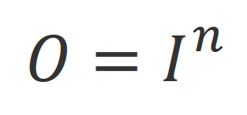

Advanced Tank Drive
===================

Programming the drive controls is one of the most important tasks of the programming team. This section is dedicated to programming a more advanced Tank Drive. For other drivetrain types, see `Advanced Drive Programming <drivetrains.html>`_.

This guide builds a more advanced DriveContinuous command for the `Tank Drive subsystem <./../subsystems/examples/tankdrive.html>`_.

Note that this guide does not cover pneumatic gearshifting and assumes a single gear robot.

Tank Drive Control Schemes
--------------------------

There are 2 common control schemes for a tank drive robot. Both use 2 joysticks, and work best with the xbox controller. Your team may design a different scheme based on this year's game, but these are the most common and most useful.

- Tank Drive

	In the tank drive scheme, the y-axis of each joystick controls the left and right drivetrain, respectively. This scheme gives the most direct control over the motors of the robot, but has the disadvantage of being difficult to drive straight.

	.. image:: ./gfx/tankdrive.png
		:width: 70%

- Car Drive

	This scheme is designed to make the robot handle like a car, with the left joystick y-axis controlling robot speed and the right joystick x-axis controls turning. This gives less direct control over the drivetrains, but is much easier to drive straight and is preferred by many drivers.

	.. image:: ./gfx/cardrive.png
		:width: 70%

In this example, we are going to be using the Tank Drive control scheme.

Writing the DriveContinuous Command
-----------------------------------

Now for the DriveContinuous command, we need to
	+ Get controller input
	+ Output to motors

Here is a basic tank drive:

.. code-block:: java

    public class DriveContinuous extends Command {

        public DriveContinuous() {
            //requires the Drive subsystem (instantiated as drive in Robot.java)
            requires(Robot.drive);
        }

        protected void initialize() {
        }

        protected void execute()
        {
            //get joystick values
            double leftY = OI.driver.getRawAxis(OI.DRIVER_LEFT_Y_AXIS);
            double rightY = OI.driver.getRawAxis(OI.DRIVER_RIGHT_Y_AXIS);

            //set joystick values to drivetrains
            Drive.setLeftMotors(leftY);
            Drive.setRightMotors(rightY);
        }

        protected boolean isFinished() {
            return false;
        }

        protected void end() {
            //if ended, stop robot
            Robot.drive.setLeftMotors(0);
            Robot.drive.setRightMotors(0);
        }

        protected void interrupted() {
            //if interrupted, end command
            end();
        }

    }

On some controllers, the axes are flipped, meaning that pushing forward gives a negative value. For these controllers, you will have to invert the axis's values. Example:

.. code-block:: java

    double leftY = -OI.driver.getRawAxis(OI.DRIVER_LEFT_Y_AXIS);
    double rightY = -OI.driver.getRawAxis(OI.DRIVER_RIGHT_Y_AXIS);

Sensitivity and Control Curves
===============================

This is all you need to get basic Tank Drive working, but it's not very easy to control. Mapping the output of the joystick directly to the motors doesn't give much room for the driver to do lower speed precision driving.

This direct mapping of the joystick position to the motor output is a *linear control curve*, and looks like so, with the x axis representing the joystick position (-1 being all the way down, and 1 being all the way up) [1]_, and the y axis the power output to the motors from -1 to 1.

This relationship can be shown mathematically as 

.. code-block:: java

	motor output = joystick value

or

if we call the motor output O and the joystick value (input) I.

Note that this relationship doesn't give a lot of room to the lower motor speeds, which are important for precision driving. Higher speeds tend to be less important when it comes to accuracy, a driver needs to be able to control lower speeds well to get game tasks done quickly.

In order to maximize the amount of joystick room given to lower values, we use a polynomial curve (we multiply the values together to make the curve tend to stay at lower values for longer). This makes the formula:

Where n is odd [2]_. 

The higher n is, the more room is given to lower values. This can be tweaked based on your driver's preferences. 
In the following example we use n=3.
This is represented by the equation:

Changing n to a higher values gives even more preference to lower values. Here we have n=5 for O=I^5.

Great! Now our drivers can do higher precision driving, and still move at max speed when needed. There is a bit of a problem, though. Robots run on carpet, which means there's a lot of internal resistance. Outputting to the motors at very low values often won't do anything at all. This means that there's a certain threshold T after which  the robot will start to move, but it won't move before that.

It's pretty easy to see what this does to our curves in this example, where our example robot starts moving at T = 0.1 [3]_:

In this example we're using I^3 for our curve.

If the robot doesn't start moving until 0.1, then almost half of the joystick is a dead zone! This also negates our large area
for low sensitivity,  making for a pretty aggressive curve once the robot does start moving.

This is resolved by moving the curve *above* our movement threshold, so we still get our nice precision sensitivity and no dead space.

The piecewise formula for this is [4]_

For 
	+ **O** is the output to the motors
	+ **I** is the input from the joystick
	+ **n** is the odd number that determines how much the curve is stretched toward the lower values
	+ **T** is the threshold after which the robot will start to move

If we plot an example for T=0.1 and n=3:

We can see that the robot drives accurately, with most of the joystick dedicated to low values, and there are no dead zones, as the curve never crosses T=0.1.

However, there is a deadzone that we want to implement on purpose. Note that the joystick will drift, meaning that it will never quite be 0 even when the stick is released. This means that, since our piecewise function can only return 0 if the joystick input is 0, that the drive motors will always be set to either -0.1 or 0.1 even when the stick is released. This can lead to the robot moving even when the drive is not touching the controller.

To fix this, we want to add something called a deadzone. This will cause all joystick input with an absolute value less than 0.1 to register as 0.

Implementation
--------------

The implementation and addition of this curve to our example curve is a simple task, and can be done by adding an applyCurve function to the command

Here we call our T value TORQUE_RESISTANCE_THRESHOLD (this value is usually 0.05 to 0.1), and use n=3 for our polynomial curve.

.. code-block:: java

    private double applyCurve(double joystickPosition)
    {
        //apply piecewise logic
        if (joystickPosition > 0)
        {
            return (1 - RobotMap.TORQUE_RESISTANCE_THRESHOLD) * Math.pow(joystickPosition, 3) + RobotMap.TORQUE_RESISTANCE_THRESHOLD;
        }
        else if (joystickPosition < 0)
        { 
            return (1 - RobotMap.TORQUE_RESISTANCE_THRESHOLD) * Math.pow(joystickPosition, 3) - RobotMap.TORQUE_RESISTANCE_THRESHOLD;
        }

        //return 0 if joystickPosition is 0
        return 0;
    }

Additionally, add the deadzone function. This can also sometimes be found in OI.

.. code-block:: java

    private double deadzone(double value, double deadzone)
    {
        if (Math.abs(value) < deadzone)
        {
            return 0;
        }
        return value;
    }

Then, we add applyCurve and deadzone to our execute() code.

.. code-block:: java

    protected void execute()
    {
        //get joystick values
        double leftY = deadzone(OI.driver.getRawAxis(OI.DRIVER_LEFT_Y_AXIS));
        double rightY = deadzone(OI.driver.getRawAxis(OI.DRIVER_RIGHT_Y_AXIS));

        //set joystick values to drivetrains
        Drive.setLeftMotors(applyCurve(leftY));
        Drive.setRightMotors(applyCurve(rightY));
    }

And that's it! We have written a function Drive subsystem and drive command that can drive a tank drive robot using the standard Tank Drive dual joystick scheme that uses a precise sensitivity curve.

.. [1] The xbox joystick actually uses 1 for all the way down and -1 for all the way up, but we'll ignore that for the simplicity of the math and just account for it in the code

.. [2] We only use odd values here because putting negative outputs to an even value makes them positive, resulting in the robot being unable to go backwards anymore. This can be fixed for even powers by doing some tricks with absolute values, but it's not discussed here.

.. [3] Note that threshold have negative counterparts too: if the robot doesn't start moving until T=0.1, then it presumably won't start moving backwards until T=-0.1

.. [4] If you're wondering how this was derived, it was done by taking the original I^n function, moving it up by T, and solving O=a*I^n+T for a when O=1 and I=1 (which should still be the final position of the curve), and then piecewise splitting it to make it work.