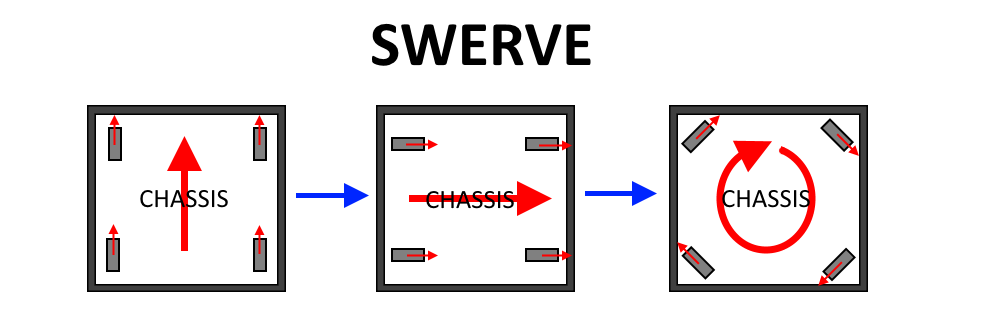
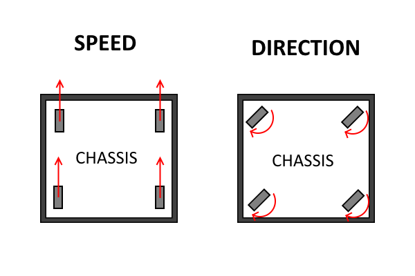
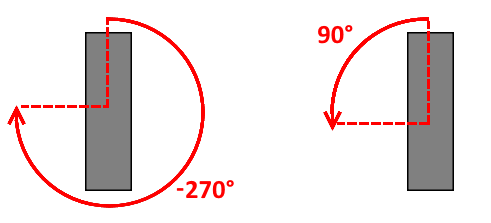
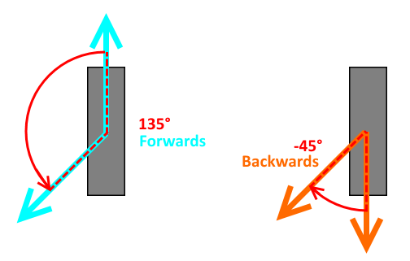
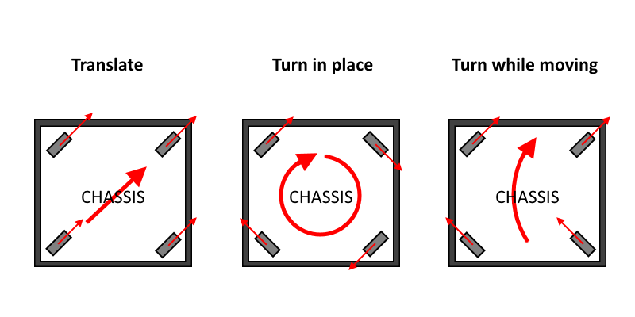
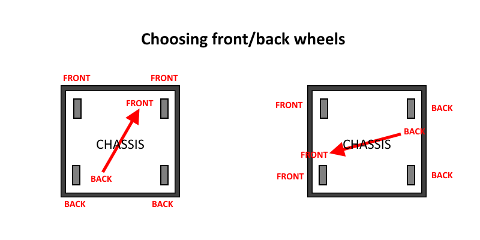
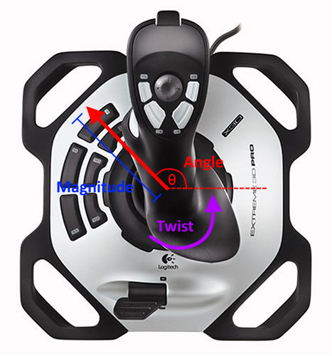
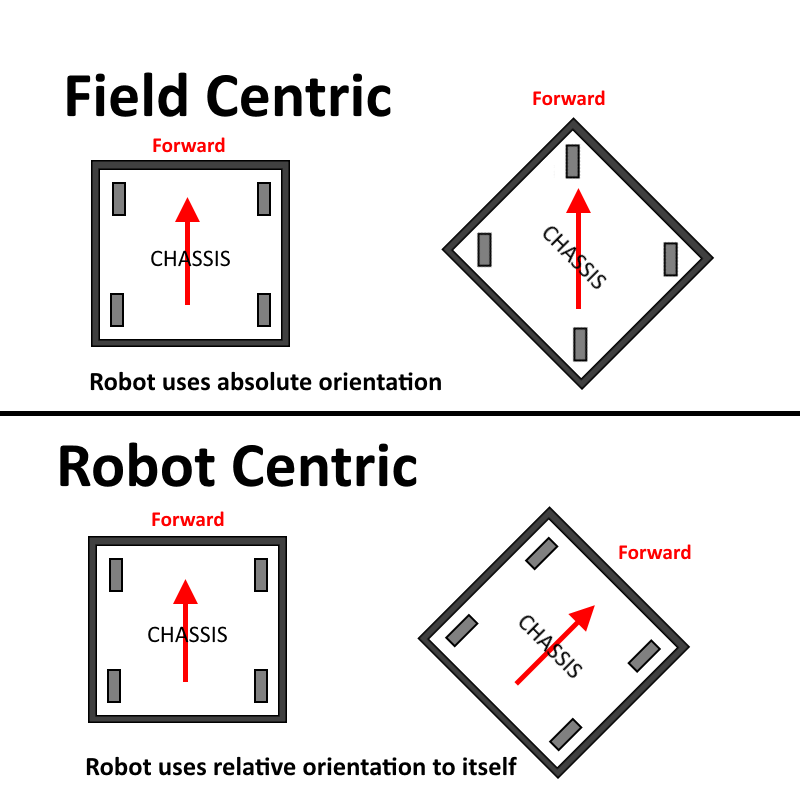

Swerve Drive
============

Swerve Drive is a type of drive train in which each wheel can point in any direction.

Since the wheels can point in any direction, the robot can move in any direction. Additionally, it can do cool maneuvers such as turning its wheels to form a circle and spinning very quickly, as shown above in the rightmost image.

Swerve drive is much more complex and much more expensive than Mecanum drive. However, it has one main advantage over Mecanum drive: swerve drive uses traction wheels, meaning that it has some pushing power, and cannot be pushed around easily. This, combined with swerve drive's mobility, allows the robot to defend effectively. mecanum drive, is more easily pushed around on the field.

This type of drive train would be used in a robot where both mobility and pushing power are both essential, and for some reason a less complex choice, such as an octocanum drive, is not feasible.

Warning
^^^^^^^

The first thing to know about a swerve drive is that it is extremely complex. A programmer that takes on the challenge of creating the swerve drive must be at least somewhat experienced with PID Controllers, creating custom PID Outputs and PID Sources, and debugging.

This complexity is not only software complexity, however, but also complexity for the rest of the team. For example, electrical must now deal with the fact that 8 motors are used for the drive alone, meaning that the total number of motors is likely to exceed 10 to 12. This means that when all of the subsystems on the robot are running, the robot is likely to brown out, even on a full battery charge. These brownouts can cripple the robot during matches.

Furthermore, software will likely have to work on solving the brownout problem, which will add more complexity on top of an already extremely complex drive subsystem. It's a mess.

Oh, and don't forget that swerve drive is also very expensive.

I would not recommend choosing swerve drive. There are many other drive trains that provide omnidirectional drive, but are much less complex and usually less risky. One good example would be a octocanum drive that can switch between tank drive and mecanum drive, which provides an omnidirectional drive mode while still providing tank drive's pushing power and speed capabilities in tank drive mode.

Swerve Drive subsystem base
---------------------------

Now that I'm done bashing swerve drive, I'll outline what a swerve drive subsystem might look like.

A swerve drive requires 4 motors to move the drive wheels (one for each wheel), 4 encoders to track distance traveled on each wheel, 4 motors to control the angle of the wheels (one for each wheel), and 4 encoders that track the angle that each wheel is facing. A swerve drive also needs a gyro, or else field centric drive is not possible.

I will refer to the motors that control how fast the drive wheels spin as the **speed** motors, and the motors that control the angles of the wheels as **direction** motors. For encoders, I refer to the ones that track distance traveled as **distance** encoders, and the ones that track the direction the wheel is facing as **direction** encoders. Note that the **direction** encoders do not actually have to be encoders. They can be magnetic encoders, for example, or any other free spinning rotation sensor.

First, start by declaring all the listed components in the class and initializing them in the constructor.

Then, notice that the direction encoder still gives encoder ticks, not an angle in degrees. To change this, we create a custom PID Source that allows us to apply a scaling factor to the sensor value. One example of this is the `PIDSourceExtended class <http://nacsvn.aasd.k12.wi.us/repos/nac-software-2017/robot/trunk/Team93Robot2017/src/org/usfirst/frc/team93/robot/utilities/PIDSourceExtended.java>`_ from 2017. This class uses its setGain(double scalingFactor) method to convert the encoder values to degrees. Make sure to declare and initialize those too.

.. code-block:: java

    /**
     * Swerve Drive subsystem
     */
    public class Drive extends Subsystem
    {
        // Motors
        private static CANTalon LEFT_FRONT_DRIVE_SPEED_MOTOR;
        private static CANTalon LEFT_BACK_DRIVE_SPEED_MOTOR;
        private static CANTalon RIGHT_FRONT_DRIVE_SPEED_MOTOR;
        private static CANTalon RIGHT_BACK_DRIVE_SPEED_MOTOR;
        
        private static CANTalon LEFT_FRONT_DRIVE_DIRECTION_MOTOR;
        private static CANTalon LEFT_BACK_DRIVE_DIRECTION_MOTOR;
        private static CANTalon RIGHT_FRONT_DRIVE_DIRECTION_MOTOR;
        private static CANTalon RIGHT_BACK_DRIVE_DIRECTION_MOTOR;

        // Encoders
        public static Encoder LEFT_FRONT_DRIVE_DISTANCE_ENCODER;
        public static Encoder LEFT_BACK_DRIVE_DISTANCE_ENCODER;
        public static Encoder RIGHT_FRONT_DRIVE_DISTANCE_ENCODER;
        public static Encoder RIGHT_BACK_DRIVE_DISTANCE_ENCODER;
        public static MedianPIDSource DRIVE_DISTANCE_ENCODERS;

        public static Encoder LEFT_FRONT_DRIVE_DIRECTION_ENCODER;
        public static Encoder LEFT_BACK_DRIVE_DIRECTION_ENCODER;
        public static Encoder RIGHT_FRONT_DRIVE_DIRECTION_ENCODER;
        public static Encoder RIGHT_BACK_DRIVE_DIRECTION_ENCODER;

        // Direction encoder wrapper that scales to degrees
        public static PIDSourceExtended LEFT_FRONT_DRIVE_DIRECTION_SCALED;
        public static PIDSourceExtended LEFT_BACK_DRIVE_DIRECTION_SCALED;
        public static PIDSourceExtended RIGHT_FRONT_DRIVE_DIRECTION_SCALED;
        public static PIDSourceExtended RIGHT_BACK_DRIVE_DIRECTION_SCALED;
        
        // Gyro
        public static AHRS DRIVE_GYRO; 

        public Drive()
        {
            // Motors
            LEFT_FRONT_DRIVE_SPEED_MOTOR = new CANTalon(RobotMap.LEFT_FRONT_DRIVE_SPEED_MOTOR_PIN);
            LEFT_BACK_DRIVE_SPEED_MOTOR = new CANTalon(RobotMap.LEFT_BACK_DRIVE_SPEED_MOTOR_PIN);
            RIGHT_FRONT_DRIVE_SPEED_MOTOR = new CANTalon(RobotMap.RIGHT_FRONT_DRIVE_SPEED_MOTOR_PIN);
            RIGHT_BACK_DRIVE_SPEED_MOTOR = new CANTalon(RobotMap.RIGHT_BACK_DRIVE_SPEED_MOTOR_PIN);

            LEFT_FRONT_DRIVE_DIRECTION_MOTOR = new CANTalon(RobotMap.LEFT_FRONT_DRIVE_DIRECTION_MOTOR_PIN);
            LEFT_BACK_DRIVE_DIRECTION_MOTOR = new CANTalon(RobotMap.LEFT_BACK_DRIVE_DIRECTION_MOTOR_PIN);
            RIGHT_FRONT_DRIVE_DIRECTION_MOTOR = new CANTalon(RobotMap.RIGHT_FRONT_DRIVE_DIRECTION_MOTOR_PIN);
            RIGHT_BACK_DRIVE_DIRECTION_MOTOR = new CANTalon(RobotMap.RIGHT_BACK_DRIVE_DIRECTION_MOTOR_PIN);

            // Encoders
            LEFT_FRONT_DRIVE_DISTANCE_ENCODER = new Encoder(RobotMap.LEFT_FRONT_DRIVE_DISTANCE_ENCODER_PIN_A, RobotMap.LEFT_FRONT_DRIVE_DISTANCE_ENCODER_PIN_B);
            LEFT_BACK_DRIVE_DISTANCE_ENCODER = new Encoder(RobotMap.LEFT_BACK_DRIVE_DISTANCE_ENCODER_PIN_A, RobotMap.LEFT_BACK_DRIVE_DISTANCE_ENCODER_PIN_B);
            RIGHT_FRONT_DRIVE_DISTANCE_ENCODER = new Encoder(RobotMap.RIGHT_FRONT_DRIVE_DISTANCE_ENCODER_PIN_A, RobotMap.RIGHT_FRONT_DRIVE_DISTANCE_ENCODER_PIN_B);
            RIGHT_BACK_DRIVE_DISTANCE_ENCODER = new Encoder(RobotMap.RIGHT_BACK_DRIVE_DISTANCE_ENCODER_PIN_A, RobotMap.RIGHT_BACK_DRIVE_DISTANCE_ENCODER_PIN_B);
            DRIVE_ENCODERS = new MedianPIDSource(LEFT_FRONT_DRIVE_DISTANCE_ENCODER, LEFT_BACK_DRIVE_DISTANCE_ENCODER, RIGHT_FRONT_DRIVE_DISTANCE_ENCODER, RIGHT_BACK_DRIVE_DISTANCE_ENCODER);
            
            LEFT_FRONT_DRIVE_DIRECTION_ENCODER = new Encoder(RobotMap.LEFT_FRONT_DRIVE_DIRECTION_ENCODER_PIN_A, RobotMap.LEFT_FRONT_DRIVE_DIRECTION_ENCODER_PIN_B);
            LEFT_BACK_DRIVE_DIRECTION_ENCODER = new Encoder(RobotMap.LEFT_BACK_DRIVE_DIRECTION_ENCODER_PIN_A, RobotMap.LEFT_BACK_DRIVE_DIRECTION_ENCODER_PIN_B);
            RIGHT_FRONT_DRIVE_DIRECTION_ENCODER = new Encoder(RobotMap.RIGHT_FRONT_DRIVE_DIRECTION_ENCODER_PIN_A, RobotMap.RIGHT_FRONT_DRIVE_DIRECTION_ENCODER_PIN_B);
            RIGHT_BACK_DRIVE_DIRECTION_ENCODER = new Encoder(RobotMap.RIGHT_BACK_DRIVE_DIRECTION_ENCODER_PIN_A, RobotMap.RIGHT_BACK_DRIVE_DIRECTION_ENCODER_PIN_B);

            // Direction encoder wrapper that scales to degrees
            LEFT_FRONT_DRIVE_DIRECTION_SCALED = new PIDSourceExtended(LEFT_FRONT_DRIVE_DIRECTION_ENCODER);
            LEFT_BACK_DRIVE_DIRECTION_SCALED = new PIDSourceExtended(LEFT_BACK_DRIVE_DIRECTION_ENCODER);
            RIGHT_FRONT_DRIVE_DIRECTION_SCALED = new PIDSourceExtended(RIGHT_FRONT_DRIVE_DIRECTION_ENCODER);
            RIGHT_BACK_DRIVE_DIRECTION_SCALED = new PIDSourceExtended(RIGHT_BACK_DRIVE_DIRECTION_ENCODER);

            // Gyro
            DRIVE_GYRO = new AHRS(RobotMap.MXP_PORT);
        }

        public void initDefaultCommand()
        {

        }
    }

Directing the wheels
--------------------

Since swerve drive wheels can rotate to any angle, we need a way to represent that in code. We do this by creating a custom class that represents a swerve drive wheel, called SwerveDriveWheel.

The goal of this class is to be able to set the wheel to an angle in code, which causes the wheel to turn and face that direction relative to the robot. To accomplish this, we create a PID Controller that takes input from the wheel direction encoder, and outputs to the wheel direction motor. Then, when we set the wheel, we simply set the PID Controller's setpoint, which will cause the wheel to turn to the angle we set it to.

.. code-block:: java

    public class SwerveDriveWheel
    {
        public PIDController directionController;
        public PIDOutput directionMotor;
        public PIDSource directionSensor;

        public SwerveDriveWheel(double P, double I, double D, PIDSource directionSensor, PIDOutput directionMotor)
        {
            this.directionSensor = directionSensor;
            this.directionMotor = directionMotor;
            directionController = new PIDController(P, I, D, directionSensor, directionMotor);
        }

        public void setDirection(double setpoint)
        {
            directionController.reset();
            directionController.setSetpoint(setpoint);
            directionController.enable();
        }
    }

Note, however, that the current system is a bit un-optimized. If we tell the wheel to turn to -270°, for example, it will actually rotate the full -270°, not knowing that a faster way would be to simply rotate to 90°. We instead want the wheel to find the fastest way to get to its angle setpoint.

One example of a method that calculates the shortest way to get between two angles is shown here:

.. code-block:: java

	/**
	 * Get the closest angle between the given angles.
	 */
	private static double closestAngle(double a, double b)
	{
		// get direction
		double dir = modulo(b, 360.0) - modulo(a, 360.0);
		
		// convert from -360 to 360 to -180 to 180
		if (Math.abs(dir) > 180.0)
		{
			dir = -(Math.signum(dir) * 360.0) + dir;
		}
		return dir;
	}

We can use this method to find the fastest way from our current wheel angle to the desired wheel angle.

.. code-block:: java

    public void setDirection(double setpoint)
    {
        directionController.reset();
        
        // use the fastest way
        double currentAngle = directionSensor.get();
        directionController.setSetpoint(currentAngle + closestAngle(currentAngle, setpoint));

        directionController.enable();
    }

Another thing to keep in mind is that we can optimize this system even further. Instead of turning the wheel 135°, we can just turn the wheel to -45° and reverse the speed motor's direction. To do this, we can make use of the `PIDOutputExtended class <http://nacsvn.aasd.k12.wi.us/repos/nac-software-2017/robot/trunk/Team93Robot2017/src/org/usfirst/frc/team93/robot/utilities/PIDOutputExtended.java>`_, which allows us to add a scaling factor (called a gain). To reverse the motor, we simply set the gain to -1.0, and to undo the reversal, we set it back to 1.0. We also need to pass in the speed motor into the constructor.

Then, in our setDirection method, to figure out whether to reverse the motor or not, we compare the angular distances to both the setpoint and the setpoint + 180°. For example, if the setpoint given to us is 135°, then we'd find the closest angle to 135° (the distance is 135°), as well as the closest angle to 135° + 180° (the distance is -45°). Since the closest angle to 135° + 180° is shorter, we would flip the motor direction, and turn to -45°.

.. code-block:: java

    public class SwerveDriveWheel
    {
        public PIDController directionController;
        public PIDOutput directionMotor;
        public PIDOutputExtended speedMotor;
        public PIDSource directionSensor;

        public SwerveDriveWheel(double P, double I, double D, PIDSource directionSensor, PIDOutput directionMotor, PIDOutput speedMotor)
        {
            this.directionSensor = directionSensor;
            this.directionMotor = directionMotor;
            this.speedMotor = new PIDOutputExtended(speedMotor);
            directionController = new PIDController(P, I, D, directionSensor, directionMotor);
        }

        public void setDirection(double setpoint)
        {
            directionController.reset();
            
            double currentAngle = directionSensor.get();
            // find closest angle to setpoint
            double setpointAngle = closestAngle(currentAngle, setpoint);
            // find closest angle to setpoint + 180
            double setpointAngleFlipped = closestAngle(currentAngle, setpoint + 180.0);
            // if the closest angle to setpoint is shorter
            if (Math.abs(setpointAngle) <= Math.abs(setpointAngleFlipped))
            {
                // unflip the motor direction use the setpoint
                directionMotor.setGain(1.0);
                directionController.setSetpoint(currentAngle + setpointAngle);
            }
            // if the closest angle to setpoint + 180 is shorter
            else
            {
                // flip the motor direction and use the setpoint + 180
                directionMotor.setGain(-1.0);
                directionController.setSetpoint(currentAngle + setpointAngleFlipped);
            }

            directionController.enable();
        }

        public void setSpeed(double speed)
        {
            speedMotor.set(speed);
        }
    }

Notice that, since we are using our custom version of the directionMotor passed in, we now include a setSpeed method too.

Now, the wheel goes the shortest path to any angle passed to it with setDirection. Make sure to add these new components into the subsystem:

Declare in the class:

.. code-block:: java

    SwerveDriveWheel LEFT_FRONT_DRIVE_WHEEL;
    SwerveDriveWheel LEFT_BACK_DRIVE_WHEEL;
    SwerveDriveWheel RIGHT_FRONT_DRIVE_WHEEL;
    SwerveDriveWheel RIGHT_BACK_DRIVE_WHEEL;

and initialize in the constructor:

.. code-block:: java
    :emphasize-lines: 8,9,10,11,12,13,14,15

    public Drive()
    {
        ...

        // Gyro
        DRIVE_GYRO = new AHRS(RobotMap.MXP_PORT);

        // SwerveDriveWheels
        double wheelP = 0.02;
        double wheelI = 0.001;
        double wheelD = 0.0;
        LEFT_FRONT_DRIVE_WHEEL = new SwerveDriveWheel(wheelP, wheelI, wheelD, LEFT_FRONT_DRIVE_DIRECTION_SCALED, LEFT_FRONT_DRIVE_DIRECTION_MOTOR, LEFT_FRONT_DRIVE_SPEED_MOTOR);
        LEFT_BACK_DRIVE_WHEEL = new SwerveDriveWheel(wheelP, wheelI, wheelD, LEFT_BACK_DRIVE_DIRECTION_SCALED, LEFT_BACK_DRIVE_DIRECTION_MOTOR, LEFT_BACK_DRIVE_SPEED_MOTOR);
        RIGHT_FRONT_DRIVE_WHEEL = new SwerveDriveWheel(wheelP, wheelI, wheelD, RIGHT_FRONT_DRIVE_DIRECTION_SCALED, RIGHT_FRONT_DRIVE_DIRECTION_MOTOR, RIGHT_FRONT_DRIVE_SPEED_MOTOR);
        RIGHT_BACK_DRIVE_WHEEL = new SwerveDriveWheel(wheelP, wheelI, wheelD, RIGHT_BACK_DRIVE_DIRECTION_SCALED, RIGHT_BACK_DRIVE_DIRECTION_MOTOR, RIGHT_BACK_DRIVE_SPEED_MOTOR);
    }

Coordinating the Swerve Drive
-----------------------------

Now that we've created a class that allows us to direct the wheels, we can now get started on setting those wheel directions to coordinate driving.

There are 3 different things a swerve drive can do:

 - Move in any direction (this is called *translating*)
 - Turn in place
 - Turn while moving

These are all done with different wheel arrangements:

Firstly, let's create a class called SwerveDriveCoordinator. Pass in 4 SwerveDriveWheels.

.. code-block:: java

    public class SwerveDriveCoordinator
    {
        SwerveDriveWheel leftFrontWheel;
        SwerveDriveWheel leftBackWheel;
        SwerveDriveWheel rightFrontWheel;
        SwerveDriveWheel rightBackWheel;

        public SwerveDriveCoordinator(SwerveDriveWheel leftFrontWheel, SwerveDriveWheel leftBackWheel, SwerveDriveWheel rightFrontWheel, SwerveDriveWheel rightBackWheel)
        {
            this.leftFrontWheel = leftFrontWheel;
            this.leftBackWheel = leftBackWheel;
            this.rightFrontWheel = rightFrontWheel;
            this.rightBackWheel = rightBackWheel;
        }
    }

Let's start with translating. To translate, all we need to do is point the wheels in the direction we want to go, and give the wheels motor power.

.. code-block:: java

    public void translate(double direction, double power)
    {
        leftFrontWheel.setDirection(direction);
        leftBackWheel.setDirection(direction);
        rightFrontWheel.setDirection(direction);
        rightBackWheel.setDirection(direction);

        leftFrontWheel.setSpeed(power);
        leftBackWheel.setSpeed(power);
        rightFrontWheel.setSpeed(power);
        rightBackWheel.setSpeed(power);
    }

Then, for turning in place, all we need to do is set the wheels to point in a circle:

.. code-block:: java

    public void inplaceTurn(double power)
    {
        leftFrontWheel.setDirection(135.0);
        leftBackWheel.setDirection(45.0);
        rightFrontWheel.setDirection(-45.0);
        rightBackWheel.setDirection(-135.0);

        leftFrontWheel.setSpeed(power);
        leftBackWheel.setSpeed(power);
        rightFrontWheel.setSpeed(power);
        rightBackWheel.setSpeed(power);
    }

Lastly, for turning while moving, we need to angle the wheels to look like the *Turning while moving* image above. However, to do this, we need to choose which wheels are the front wheels and which ones are the back wheels. We do this by assigning each wheel an angle, and then checking to see if it's closer to the front (the direction we're moving in) or the back (180° + the direction we're moving in).

And, when assigning angles to wheels, we assign each wheel to its angle from the center:

- Left Front: 135°
- Left Back: 225°
- Right Front: 45°
- Right Back: 315°

Then, once we find out which two wheels are in front and which two are in back, then we add a bit more to the front wheels' angles, and subtract a bit from the back wheels' angles. This will cause the robot to rotate. We're again going to have to use the closestAngle method here, so copy it over, or find a more elegant way of reusing it.

Additionally, we have to convert turnPower, which is -1.0 to 1.0, to an angle to add/subtract on the wheel angles. A good way to do that is simply multiply it by 45.0.

.. code-block:: java

    public void translateTurn(double direction, double translatePower, double turnPower)
    {
        double turnAngle = turnPower * 45.0;
        
        // if the left front wheel is in the front
        if (closestAngle(direction, 135.0) >= 90.0)
        {
            leftFrontWheel.setDirection(direction + turnAngle);
        }
        // if it's in the back
        else
        {
            leftFrontWheel.setDirection(direction - turnAngle);
        }
        // if the left back wheel is in the front
        if (closestAngle(direction, 225.0) > 90.0)
        {
            leftBackWheel.setDirection(direction + turnAngle);
        }
        // if it's in the back
        else
        {
            leftBackWheel.setDirection(direction - turnAngle);
        }
        // if the right front wheel is in the front
        if (closestAngle(direction, 45.0) > 90.0)
        {
            rightFrontWheel.setDirection(direction + turnAngle);
        }
        // if it's in the back
        else
        {
            rightFrontWheel.setDirection(direction - turnAngle);
        }
        // if the right back wheel is in the front
        if (closestAngle(direction, 315.0) >= 90.0)
        {
            rightBackWheel.setDirection(direction + turnAngle);
        }
        // if it's in the back
        else
        {
            rightBackWheel.setDirection(direction - turnAngle);
        }

        leftFrontWheel.setSpeed(translatePower);
        leftBackWheel.setSpeed(translatePower);
        rightFrontWheel.setSpeed(translatePower);
        rightBackWheel.setSpeed(translatePower);
    }

Now, notice that if you supply no turnPower, then the translateTurn method becomes just like the translate method.

So, all we need to do now is notice that, if there is no translation commanded (power is 0.0), but there is a turn commanded (turnPower != 0.0) then we use the in-place turn method. Otherwise, we use the translateTurn method.

.. code-block:: java

    public void setSwerveDrive(double direction, double translatePower, double turnPower)
    {
        if ((translatePower == 0.0) && (turnPower != 0.0))
        {
            inplaceTurn(turnPower);
        }
        else
        {
            translateTurn(direction, translatePower, turnPower);
        }
    }

This completes the SwerveDriveCoordinator. We can now just pass in any direction, translatePower, and turnPower, and our SwerveDriveCoordinator will handle it.

Now, make sure to add it into the subsystem:

Declare it in the class:

.. code-block:: java

    public SwerveDriveCoordinator SWERVE_DRIVE_COORDINATOR;

and initialize it in the constructor:

.. code-block:: java
    :emphasize-lines: 17,18

    public Drive()
    {
        ...

        // Gyro
        DRIVE_GYRO = new AHRS(RobotMap.MXP_PORT);

        // SwerveDriveWheels
        double wheelP = 0.02;
        double wheelI = 0.001;
        double wheelD = 0.0;
        LEFT_FRONT_DRIVE_WHEEL = new SwerveDriveWheel(wheelP, wheelI, wheelD, LEFT_FRONT_DRIVE_DIRECTION_SCALED, LEFT_FRONT_DRIVE_DIRECTION_MOTOR, LEFT_FRONT_DRIVE_SPEED_MOTOR);
        LEFT_BACK_DRIVE_WHEEL = new SwerveDriveWheel(wheelP, wheelI, wheelD, LEFT_BACK_DRIVE_DIRECTION_SCALED, LEFT_BACK_DRIVE_DIRECTION_MOTOR, LEFT_BACK_DRIVE_SPEED_MOTOR);
        RIGHT_FRONT_DRIVE_WHEEL = new SwerveDriveWheel(wheelP, wheelI, wheelD, RIGHT_FRONT_DRIVE_DIRECTION_SCALED, RIGHT_FRONT_DRIVE_DIRECTION_MOTOR, RIGHT_FRONT_DRIVE_SPEED_MOTOR);
        RIGHT_BACK_DRIVE_WHEEL = new SwerveDriveWheel(wheelP, wheelI, wheelD, RIGHT_BACK_DRIVE_DIRECTION_SCALED, RIGHT_BACK_DRIVE_DIRECTION_MOTOR, RIGHT_BACK_DRIVE_SPEED_MOTOR);

        // SwerveDriveCoordinator
        SWERVE_DRIVE_COORDINATOR = new SwerveDriveCoordinator(LEFT_FRONT_DRIVE_WHEEL, LEFT_BACK_DRIVE_WHEEL, RIGHT_FRONT_DRIVE_WHEEL, RIGHT_BACK_DRIVE_WHEEL);
    }

Now, we're ready to create our DriveContinuous command.

Writing the DriveContinuous command
-----------------------------------

Now, using this coordinator, we can create a Swerve drive command. For this example, we'll use a joystick, with the direction it's pointed at being the *direction* and the joystick's magnitude away from the center being the *translationPower*. Then, using the twist axis, we can get *turnPower*.

Also, note that there are two modes for a swerve drive: Field centric, and Robot centric.

Field centric mode is control from the perspective of the driver. This means that, no matter where the robot is on the field and how it's turned, if the driver moves the joystick forward, then the robot will go forward from the driver's perspective. This type of control requires a gyro (which any swerve drive robot should have).

In Robot centric mode, however, if the robot were turned to the right, then the robot would go rightwards from the driver's perspective.

In this example, we add in one line of code to the command that makes it field centric. To make it robot centric, simply remove the line.

I also use a deadzone on the magnitude, because otherwise joystick drift will prevent the magnitude from being 0.0, which will cause the in-place turn to be unusable (since translationPower has to be 0.0).

.. code-block:: java

    /**
     * Swerve drive command
     */
    public class DriveContinuous extends Command {

        public DriveContinuous()
        {
            // Use requires() here to declare subsystem dependencies
            requires(Robot.drive);
        }

        // Called just before this Command runs the first time
        protected void initialize()
        {

        }

        // Called repeatedly when this Command is scheduled to run
        protected void execute()
        {
            // get joystick input
            double angle = Math.arctan2(OI.driver.getRawAxis(1), OI.driver.getRawAxis(0));
            double magnitude = deadzone(Math.hypot(OI.driver.getRawAxis(0), OI.driver.getRawAxis(1)), 0.1);
            double twist = deadzone(OI.driver.getRawAxis(2), 0.1);
            
            // use field centric controls by subtracting off the robot angle
            angle -= Drive.DRIVE_GYRO.get();

            Drive.SWERVE_DRIVE_COORDINATOR.setSwerveDrive(angle, magnitude, twist);
        }

        // Make this return true when this Command no longer needs to run execute()
        protected boolean isFinished()
        {
            return false;
        }

        // Called once after isFinished returns true
        protected void end()
        {
            // sets all drive wheels to 0.0
            Drive.SWERVE_DRIVE_COORDINATOR.setSwerveDrive(0.0, 0.0, 0.0);
        }

        // Called when another command which requires one or more of the same
        // subsystems is scheduled to run
        protected void interrupted()
        {
            end();
        }

        private double deadzone(double value, double deadzone)
        {
            if (Math.abs(value) < deadzone)
            {
                return 0;
            }
            return value;
        }
    }

Now, just don't forget to make DriveContinuous the default command:

.. code-block:: java

    public void initDefaultCommand()
    {
        setDefaultCommand(new DriveContinuous());
    }

And that's all there is to the extremely complex Swerve drive! It is also possible to add PID controllers to make sure the robot holds its angle and other enhancements, but those will require custom PID Outputs.

Writing the DriveForwards command
---------------------------------

For example, the way to get the robot to drive a certain distance:

In the Drive subsystem:

.. code-block:: java

    PIDOutputGroup DRIVE_ALL_MOTORS;
    
    PIDController DRIVE_DISTANCE_CONTROLLER;

.. code-block:: java

    // PID Output Groups
    DRIVE_ALL_MOTORS = new PIDOutputGroup(LEFT_FRONT_DRIVE_WHEEL.speedMotor, LEFT_BACK_DRIVE_WHEEL.speedMotor, RIGHT_FRONT_DRIVE_WHEEL.speedMotor, RIGHT_BACK_DRIVE_WHEEL.speedMotor);
    
    // PID Controllers
    DRIVE_DISTANCE_CONTROLLER = new PIDController(0.015, 0.001, 0.0, DRIVE_ENCODERS, DRIVE_ALL_MOTORS);

Then, the swerve drive's DriveForwards command can be created exactly the same as `any other drive's DriveForwards command <./../commands/examples/commands/drivesetpoint.html>`_.

A similar thing would be done with the angle. Remember that you can always make a custom PIDOutput that calls Drive.SWERVE_DRIVE_COORDINATOR.setSwerveDrive to get any behavior you want out of the swerve when using PIDs.

.. toctree::
	:glob:
	:maxdepth: 10
	:caption: Contents
	:titlesonly:

	