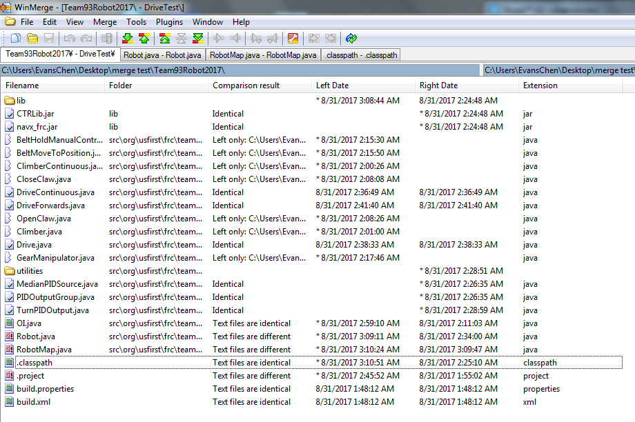

Integrating code
================

This article describes how to integrate different pieces of code written by different people, usually in different projects, into one cohesive project. Although this process is also called merging, if you're looking for how to use SVN merging to resolve conflicts, see `Resolving SVN Conflicts <svn/svnconflict.html>`_. However, code integration may still require some experience in resolving conflicts, if using SVN to merge branches into the trunk.

In the beginning of build season, development of each subsystem, along with its commands, may happen in separate branches. However, as build season draws to a close, there will be a need to integrate all of the separate subsystems and commands into one unified project, called **trunk**.

This is important, since otherwise, the robot code is scattered across multiple projects, and there is no way to fully run the robot. Additionally, it is impossible to test autonomous without a functioning trunk project.

Before integration, we start with a handful of separate projects, each containing one subsystem of the robot.

1. Code Review and Test
-----------------------

The first step before integrating a subsystem into the trunk is to make sure that it works. Testing time is incredibly scarce and valuable during build season, so you want to make sure you get the subsystem working as quickly as possible. So, before testing, make sure to thoroughly code review that subsystem to make sure the entire thing is neatly written, well documented, easily debuggable, and is (hopefully) bug free (try to catch null pointers and the like here). Also, make sure that whoever is testing the robot fully understands the code.

Then, once software can get our hands on the robot for testing, try to run that project's subsystem and get it working, making fixes where necessary. Some common bugs taht appear here include null pointers, pin allocation issues, ExceptionInInitializerErrors, and logic problems caused by typos. Once the subsystem is confirmed to work consistently, then it is ready for integration into the trunk.

2. Integration
--------------

Now, since the subsystem is confirmed to function correctly on its own, it's ready to be merged into the trunk. If SVN's branch/tag was used to create the branch, SVN may help in merging.

Otherwise, you will have to hand-merge using a tool such as WinMerge.

Example:
********

Here is an example of merging multiple subsystems into one trunk project. Be warned that integration may not go so smoothly in a real project.

In this example, there are three subsystems:

 - ClimberTest, containing the Climber subsystem
 - GearManipulatorTest, containing the GearManipulator subsystem
 - DriveTest, containing the Drive subsystem

These will all be merged into the trunk project, named Team93Robot2017.

Merging the Climber
^^^^^^^^^^^^^^^^^^^

For hand merging, it is nice to use WinMerge. First, we'll merge the climber into our blank project. In WinMerge, click **File** -> **Open**. Open up the two projects in WinMerge, with the currently bare-bones trunk project on the left and the climber project on the right. This means that, when merging, everything in the trunk project will show up on the right, and everything in the Climber project will show up on the left.

Once you open up the two projects, you'll be presented with this screen:

This list shows all of the differences between these two projects. However, we don't care about the .class files, since they are compiled code and are generated again every time the program is run. They don't count towards source code. It's OK to delete them, so delete them here so that we don't clutter up winmerge.

Now that they're deleted, let's take a look at the source files. You can see that there two files marked **Right only**. This means that they only exist in the Climber project.

Since we want everything in the climber project to go into the trunk project, we have to copy those files into the trunk project. Right click on the files, choose **Copy**, and click on **RIght to Left**.

The next three files that are more complex to integrate than simply copying over. They are OI, Robot, and RobotMap. Let's start by opening OI.

You can see that, of the two files, the Climber project's copy simply has more. So, we have to copy the text blocks that the trunk project is missing from the climber project. Do this by right clicking on the missing text blocks and clicking **Copy to Left**.

Now, there isn't any more yellow on the right side. This means that everything has been copied over.

Now, open up Robot.

Just like in OI, jsut copy the text blocks over, so that there isn't any yellow on the right side.

The same goes with RobotMap, where we simply copy over the one pin in RobotMap.

Now, since OI, Robot, and RobotMap, along with all of the missing files have been merged, we can move onto the next subsystem.

Merging the Gear Manipulator
^^^^^^^^^^^^^^^^^^^^^^^^^^^^

Close out of the trunk project and the Climber project comparison, and instead compare the trunk and the GearManipulator project.

You can see that, similarly, we can remove the .class files. Additionally, winmerge generated some .bak files as backups, and we can remove those too.

Now, take a look at the remaining files. Just like in the climber example, copy over the files marked as **Right only**.

Copy those over to the left, just like before.

This time, there are some files marked **Left only**. These are the files in the trunk that we already merged from the Climber, so don't do anything with those.

Now, open up OI. You will see that there are a few more text blocks, but the overall idea is the same as that of the Climber.

Simply copy over the text blocks to the left. Then, open up Robot.

In this case, some of the lines conflict with one another. However, if you look carefully, you'll see that you will both the gear manipulator's lines, as well as the climber's lines, since both must be imported, declared, and initialized. So, copy over the gear manipulator lines to the left, but also make sure the climber code is preserved.

.. image:: ./_static/integrate15.png
    :width: 100%

To make winmerge re-evaluate the changes, Save the files.

You can see that there is no more yellow on the right side, so we're done. Save and exit, and move on to Robot.

Similarly, copy over the code so that both pieces of code are in the trunk project's version.

There is now no more yellow on the right side, and we've finished OI, Robot, and RobotMap, as well as all the other files, so we're done merging the Gear Manipulator.

Merging the Drive
^^^^^^^^^^^^^^^^^

Merging the drive is still similar to merging the previous subsystems. Close out of the trunk project and the GearManipulator project comparison, and instead compare the trunk and the Drive project. Once again, remove the .class and the .bak files.

Once again, copy the files only in the drive project to the trunk (the right only files).

Open up Robot. This time, merging may look a bit more complex, but simply do the same thing as with the Gear Manipulator, and stick the drive code lines on top of the corresponding other code lines, so that all 3 subsystems are imported, declared, and initialized in the left file.

There is once again no more yellow on the right side, so we're done.

Do a similar thing with RobotMap, and make sure to preserve the Climber motor's pin.

Once the yellow on the right disappears, you're done.

Now, since you've copied the files over, and merged Robot and RobotMap, and OI didn't need any merging, you're done with merging Drive.

Integration testing
^^^^^^^^^^^^^^^^^^^

Open up Eclipse to make sure the merging was successful. You will have to code review the project over to make sure no merging errors occurred, but in this case, the merging seems successful.

And that is how to integrate code by hand. Try to use SVN to your advantage, please. It's a lot of work.

Afterwards, make sure to test the integrated code to make sure it all still works. If so, then you now have a functional, integrated trunk project!

.. toctree::
	:glob:
	:maxdepth: 10
	:caption: Contents