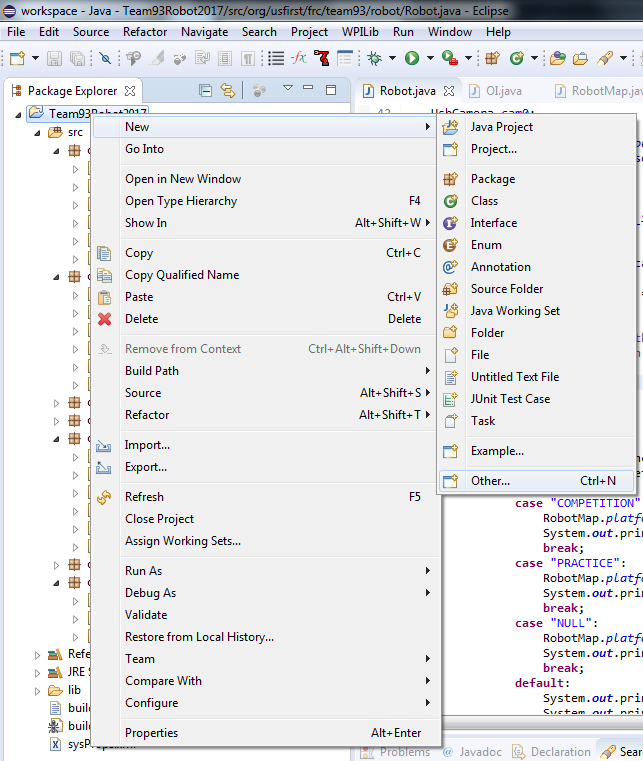
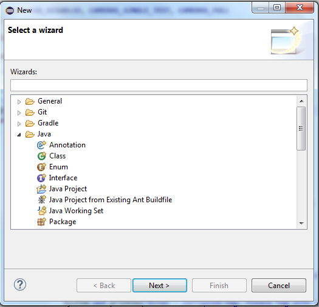
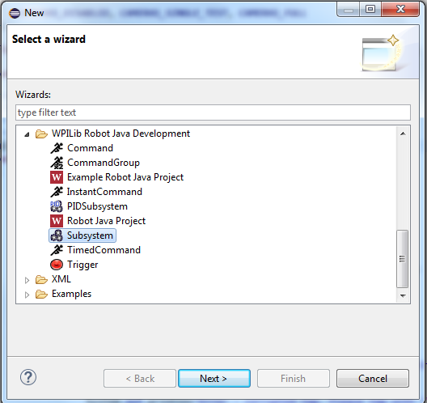
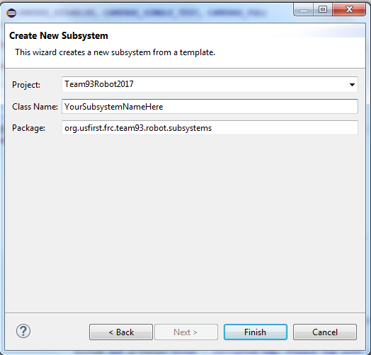
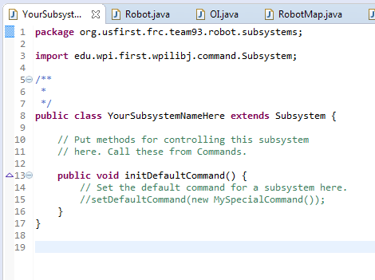

Creating a Subsystem
====================

A subsystem is a collection of components, methods, and a default command that allows any command to control the subsystem to do everything the subsystem should be able to do through its public methods and fields.

1. Find out how the subsystem works
^^^^^^^^^^^^^^^^^^^^^^^^^^^^^^^^^^^

Writing a subsystem is usually simple once you understand how the subsystem is supposed to operate. So, the first step you should take when creating a new subsystem in code is to talk to design and electrical, and find out what components and sensors are part of that subsystem. Make a list of these components.

Also, don't forget to talk about how each part functions with respect to the rest of the design. For example, maybe the motor-controlled belt can't move while certain pneumatics controlling the claw are extended, or maybe a motor is not designed to be able to turn backwards. These should be reflected in your subsystem.

For example, the drive motors on the same side in a tank drive should never turn against each other, because if they do, the motors will burn themselves out. Thus, there should not be any way for a command to do this using the Drive subsystem. However, when it comes to non-drive subsystems, these interactions may not be as obvious.

2. Create the subsystem's file
^^^^^^^^^^^^^^^^^^^^^^^^^^^^^^

Right click on the project and choose **New** -> **Other**.

Then, in the New window that appears, scroll down to **WPILib Robot Java Development** and choose **Command**.

Then, name your command.

Press **Finish**, and it should be created.

3. Add the components of the subsystem
^^^^^^^^^^^^^^^^^^^^^^^^^^^^^^^^^^^^^^

Using the list of components in that subsystem from design and electrical, you can simply just add every single component to the subsystem. Don't forget to make sure to add and access their corresponding pins in RobotMap.

See `Components <./../../robotcode/components/components.html>`_ to learn more about how to create certain components in code.

You may be required to group together certain actuators, such as in the case of Drive, where you need to group together the right and left motors into PIDOutputGroups.

This may also occur with sensors, such as grouping together the Drive encoders into a median reading.

You may also need to create a PID Controller, to control some aspect of the subsystem, if it needs to be able to move to certain positions, or hold a certain speed in some way.

4. Add the public methods of the subsystem
^^^^^^^^^^^^^^^^^^^^^^^^^^^^^^^^^^^^^^^^^^

Most components should be private, since they should not be accessed directly. They should instead be accessed through public methods. These public methods must take into account each component's interaction with the design to make sure that no matter what code a command runs, the subsystem should operate safely.

For example, the drive subsystem should have public methods grouping together the motors on each side, to make sure they dont' go against each other. There should also be methods to read from encoders and stop the motors if necessary.

This explanation of subsystems is poor since each subsystem can be very different. See these examples for more specific ways that subsystems are implemented.

 - `Climber <examples/climber.html>`_
 	A simple subsystem that only contains one motor that turns.

 - `Gear Manipulator <examples/gearmanip.html>`_
 	The gear manipulator subsystem from 2017.

 - `Drive <examples/tankdrive.html>`_
 	A fairly standard tank drive subsystem.

List of example subsystems:

.. toctree::
	:glob:
	:maxdepth: 10
	
	examples/examplesubsystems

5. Add the subsystem to Robot
^^^^^^^^^^^^^^^^^^^^^^^^^^^^^

Then, go to Robot and add the declaration of the subsystem in the class. Example:

.. code-block:: java

	public static Drive drive;

Then, make sure to instantiate the subsystem in robotInit().

.. code-block:: java

	drive = new Drive();

Now, the subsystem has been added to Robot.

After the subsystem is complete, it may be helpful to add a default command if the command exists for that subsystem.

And you're done! The subsystem has now been created.